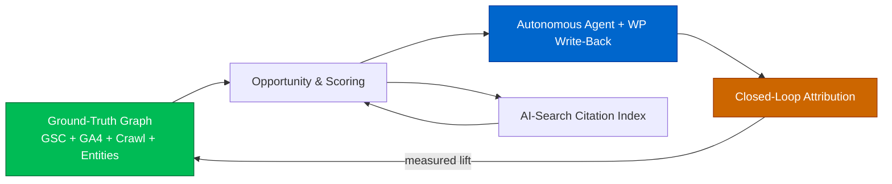
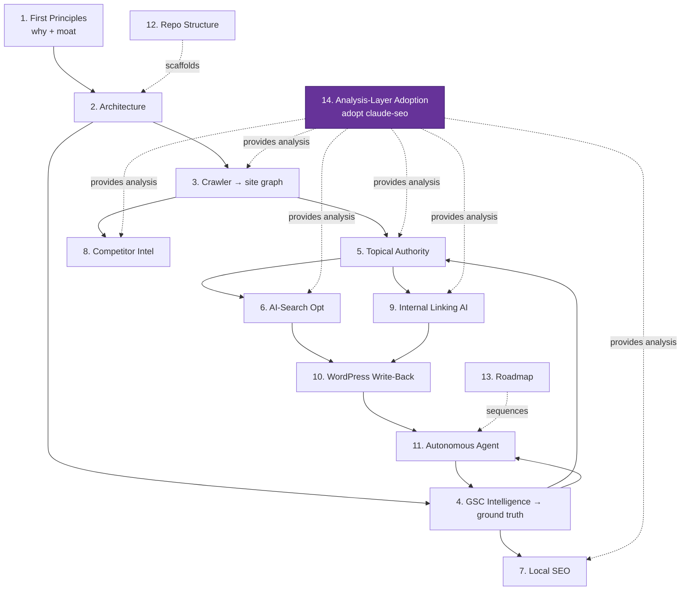

# GOAAISEO — Master Technical Blueprint

> The autonomous SEO Operating System. This master document is the executive narrative and
> index; each phase has a deep-dive doc under [`docs/blueprint/`](blueprint/).

---

## Executive summary

GOAAISEO reframes SEO tooling around two assets incumbents don't own together: **ground truth**
(your real Search Console + GA4 data, de-aggregated and stored forever) and **action** (an
autonomous agent that ships schema, links, and content into your CMS and measures the result).

Read-only estimation tools (Ahrefs, Semrush) tell you *what might be happening elsewhere*.
Crawlers (Screaming Frog, Sitebulb) tell you *what your structure is*. Content tools (Surfer,
Clearscope, MarketMuse) optimize *one page*. None of them close the loop:
**truth → insight → action → measured outcome → learning.** GOAAISEO does, and in doing so
builds two compounding, hard-to-copy indexes:

1. **Outcome causality index** — which actions produced lift, for which site archetypes.
2. **AI-search citation index** — which domains get cited by which generative engines for which prompts.

---

## How the phases fit together

---

## Phase index

1. [First-Principles Analysis](blueprint/01-first-principles.md) — capabilities, tool benchmark, weaknesses, AI opportunities, the 5-pillar moat.
2. [System Architecture](blueprint/02-system-architecture.md) — Next.js + NestJS + Python/FastAPI + Postgres(pgvector/Timescale) + Redis, with rationale and diagrams.
3. [SEO Crawler Engine](blueprint/03-crawler-engine.md) — distributed render-aware crawler, full schema, site graph, PageRank/orphans/dupes.
4. [Search Console Intelligence](blueprint/04-search-console-intelligence.md) — de-aggregated GSC time-series + 5 opportunity scoring models + unified priority score.
5. [Topical Authority Engine](blueprint/05-topical-authority-engine.md) — embeddings + clustering → coverage, missing clusters, content gaps, entity map.
6. [AI Search Optimization](blueprint/06-ai-search-optimization.md) — GEO/AEO: prompt-space, multi-engine citation probing, the 6-component GEO Score.
7. [Local SEO Engine](blueprint/07-local-seo-engine.md) — GBP health, NAP consistency, geo-grid SoLV, local landing-page gaps.
8. [Competitor Intelligence](blueprint/08-competitor-intelligence.md) — snapshot diffing, change events, significance + causal correlation.
9. [Internal Linking AI](blueprint/09-internal-linking-ai.md) — link-value scoring, anchor suggestion, equity redistribution, silo planning.
10. [WordPress Integration](blueprint/10-wordpress-integration.md) — plugin architecture, REST API, reversible write-back as the action surface.
11. [Autonomous SEO Agent](blueprint/11-autonomous-agent.md) — plan/act/observe/reflect loop, 4-layer memory, closed-loop attribution, guardrails.
12. [Repository Structure](blueprint/12-repository-structure.md) — production polyglot monorepo, CI/CD, conventions.
13. [Implementation Roadmap](blueprint/13-implementation-roadmap.md) — 4 phases, ~70 EW, dependency graph, risks, MVP cut-line.
14. [Analysis-Layer Adoption](blueprint/14-analysis-layer-adoption.md) — buy vs. build: adopt the open-source `claude-seo` engine for the analysis surface (Phases 3,5,6,7 + augment 8,9); build only the closed-loop moat.

---

## The unifying data structure: the Ground-Truth Graph

Everything writes into and reads from one per-tenant model:

- **Nodes:** pages, queries, entities, topic clusters, local businesses, competitors.
- **Edges:** internal links (weighted by PageRank), page↔query (GSC), page↔entity (salience), page↔cluster (membership), competitor↔event.
- **Time-series overlay:** daily GSC metrics, crawl snapshots, citation probes, geo-grid scans — enabling diffs, trends, decay, and attribution.

Every engine (Phases 3–9) enriches this graph; the agent (Phase 11) reasons over it and acts;
attribution writes measured outcomes back onto it. The longer a tenant runs, the richer the
graph — which is precisely why the moat compounds.

---

## Design tenets (applied throughout)

- **Truth over estimates.** First-party GSC/GA4 is the spine; third-party data augments, never replaces.
- **Everything explainable.** Every score stores its evidence; every action states "why + expected lift."
- **Action is first-class.** Recommendations carry a `change_id`, are reversible, and are measured.
- **Async by default.** Crawl/ML/scoring run in queues; the product stays responsive.
- **Multi-tenant safe.** Postgres RLS on every table; reversible, guardrailed automation.

For the full reasoning, start with [Phase 1](blueprint/01-first-principles.md).
