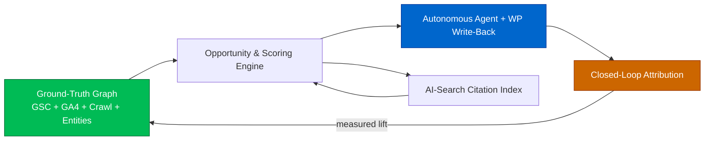

# Phase 1 — First-Principles Analysis

> Goal: Strip SEO down to physics, not folklore. Define what a 2026-era SEO
> Operating System *must* do, benchmark incumbents brutally, and locate the
> defensible wedge for GOAAISEO.

---

## 1.1 What SEO actually is (first principles)

Search systems — classic (Google, Bing) and generative (ChatGPT Search, Gemini,
Perplexity, AI Overviews) — perform four operations:

1. **Discovery & Crawl** — can the machine find and fetch the content?
2. **Understanding** — can it parse entities, topics, structure, and trust?
3. **Retrieval & Ranking** — does it select your content for a query/intent?
4. **Presentation** — does it show a link, a snippet, or *synthesize an answer that cites you*?

Therefore an SEO Operating System must own four mirrored capabilities:

| Search system op | Required OS capability |
|---|---|
| Discovery & Crawl | **Crawl & structural modeling** of your site as a graph |
| Understanding | **Entity / topic / E-E-A-T modeling** |
| Retrieval & Ranking | **Ground-truth performance ingestion** (GSC/GA4) + opportunity scoring |
| Presentation | **AI-search (GEO/AEO) optimization** + SERP-feature targeting |

Everything else (reporting, dashboards, alerts) is packaging.

---

## 1.2 Capabilities a next-generation SEO OS must have in 2026

### Tier 0 — Ground truth (the foundation everyone treats as an afterthought)
- First-party **Google Search Console** ingestion at full granularity (query × page × device × country × date), de-aggregated and stored as time-series.
- **GA4** behavioral + conversion data joined to landing pages and queries.
- **Bing Webmaster Tools** + emerging AI-search referral logs (ChatGPT/Perplexity referrers in GA4).

### Tier 1 — Structural truth
- High-throughput **JS-rendering crawler** (HTML + headless render parity check).
- Full **site graph**: pages as nodes, links as weighted edges, PageRank/CheiRank computed internally.
- Technical audit: canonicals, redirects, status codes, hreflang, indexability, Core Web Vitals (CrUX + lab), structured data validation.

### Tier 2 — Semantic truth
- **Entity extraction** + linking to Knowledge Graph / Wikidata.
- **Topical authority map**: topic clusters, coverage %, missing clusters, semantic gaps via embeddings.
- **Cannibalization & content-overlap** detection across the corpus.

### Tier 3 — AI-search optimization (GEO/AEO) — the 2026 differentiator
- Measure **citation surface**: are you cited by ChatGPT/Gemini/Perplexity/AI Overviews for target prompts?
- Optimize for **answer extractability**: passage structure, claim density, schema, source authority.
- Track **prompt-space** (the questions AI answers) the way we track keyword-space.

### Tier 4 — Local
- Google Business Profile (GBP) intelligence, NAP consistency, citation gaps, grid-rank tracking, review velocity.

### Tier 5 — Competitive
- Continuous **change detection** on competitor content, schema, internal linking, and new/lost pages.

### Tier 6 — Action & autonomy (the moat layer)
- **Autonomous agent** that crawls daily, detects issues, generates briefs/schema/links, and pushes fixes to the CMS.
- **Closed-loop attribution**: every recommendation is tagged, deployed, and measured against GSC ground truth.

> **First-principles insight:** Incumbents stop at Tiers 1–2 and sell *information*.
> The defensible product sells **outcomes** by owning Tier 0 (truth) + Tier 6 (action)
> and closing the loop between them.

---

## 1.3 Competitive benchmark — who wins each category

| Category | Best-in-class | Why they win |
|---|---|---|
| Backlink index & competitive discovery | **Ahrefs** | Largest/freshest independent link crawler; clean UX; reliable metrics (DR, UR). |
| All-in-one keyword + market data | **Semrush** | Breadth: keyword DB, ads, PR, market intelligence; huge keyword corpus. |
| Technical crawl (desktop) | **Screaming Frog** | Gold-standard configurable crawler; granular, scriptable, trusted by technical SEOs. |
| Technical crawl (cloud + insight) | **Sitebulb** | Best *interpretation* of crawl data — prioritized hints, audit scoring, visualizations. |
| On-page content optimization | **Surfer SEO** | Fast SERP-driven content scoring + editor; good for writers shipping quickly. |
| Editorial content grading | **Clearscope** | Cleanest term/relevance grading; trusted by editorial teams; tight Docs/WP integration. |
| Topic/content strategy | **MarketMuse** | Topic modeling, content inventory, authority scoring at strategy level. |
| AI-assisted content briefs | **Frase** | Fast SERP→brief→draft workflow; affordable AEO-leaning features. |
| Local SEO management | **BrightLocal** | Citation building/audit, review mgmt, local rank tracking at scale. |
| Local rank-grid precision | **Local Falcon** | Geo-grid GBP rank tracking with map-pin granularity; share-of-local-voice. |
| First-party search truth | **Google Search Console** | The only source of *your real* impressions/clicks/positions/queries. |
| First-party behavior truth | **Google Analytics (GA4)** | Real user behavior, conversions, and (increasingly) AI-referral traffic. |

---

## 1.4 Weaknesses of every tool (the opportunity map)

| Tool | Core weaknesses |
|---|---|
| **Ahrefs** | Estimated traffic/keywords (not your truth); weak on-page/content workflow; no autonomous action; limited GA4/GSC fusion; minimal AI-search citation tracking; no CMS write-back. |
| **Semrush** | Sprawling/overwhelming UX; data accuracy varies by market; estimates not ground truth; shallow technical-render depth; expensive add-on model; weak true automation. |
| **Screaming Frog** | Desktop, single-machine scale ceiling; no historical time-series; manual; no demand/GSC intelligence beyond a connector; no semantic/topic layer; no action. |
| **Sitebulb** | Crawl-only; no keyword/demand data; no content generation; limited API/programmatic use; not built for AI-search. |
| **Surfer SEO** | Page-level only — ignores site-wide topical structure & cannibalization; can encourage over-optimization to term targets; correlation-driven, not causal; thin technical SEO. |
| **Clearscope** | Narrow (term grading); expensive per-document; no technical, no crawl, no GSC opportunity engine, no automation. |
| **MarketMuse** | Strategy-heavy but slow/expensive; opaque scoring; weak technical + local + AI-search; limited write-back. |
| **Frase** | Quality ceiling on generated content; shallow technical depth; limited enterprise scale & data fusion. |
| **BrightLocal** | Local-only; citation data freshness gaps; limited content/technical/AI-search; reporting-centric. |
| **Local Falcon** | Single-purpose grid tracking; no content/technical/backlink; insight without action. |
| **Google Search Console** | 16-month limit, sampling/aggregation hides query-page pairs, 1k-row UI cap, no scoring/prioritization, no recommendations, no cross-tool joins, no action. |
| **Google Analytics (GA4)** | Steep model; not SEO-specific; thresholding/sampling; no keyword visibility (data lost post-`not provided`); requires heavy modeling to be SEO-useful. |

**Pattern across all of them:** they are **read-only advisory tools**. None close the loop
from *truth → insight → action → measured outcome*. None treats AI-search citations as a
first-class, trackable surface. None unifies first-party ground truth with a semantic site graph.

---

## 1.5 Where AI can structurally outperform incumbents

1. **De-aggregate GSC ground truth at scale.** Bulk Export + automated query×page joins reveal cannibalization, CTR gaps, and decay that the GSC UI mathematically hides.
2. **Semantic site graph + embeddings.** Cluster the entire corpus, compute topical coverage %, and detect *missing* clusters competitors rank for — beyond keyword string matching.
3. **Causal opportunity scoring.** Combine position, impressions, CTR-curve deltas, and trend slope into a single prioritized ROI score, not a vanity metric.
4. **GEO/AEO measurement.** Programmatically probe AI engines for target prompts, parse citations, and score answer-extractability — a surface incumbents barely touch.
5. **Generation + write-back.** LLMs draft schema, internal-link sets, FAQ blocks, and content briefs grounded in *your* GSC data and entity gaps, then deploy via the WP plugin.
6. **Autonomy + memory.** A daily agent that remembers what it changed, attributes impact, and compounds learning — turning SEO from periodic audits into continuous optimization.
7. **Explainable prioritization.** Natural-language "why this, why now, expected lift" for every recommendation — the layer humans actually trust and act on.

---

## 1.6 The GOAAISEO moat

A durable moat is built from compounding, hard-to-copy assets — not features.

### Moat pillar 1 — The Ground-Truth Graph (data moat)
Per-tenant, we persist a fused, time-series **Truth Graph**: GSC (query×page×device×country×date)
+ GA4 conversions + crawl site-graph + entity/topic model. The longer a customer stays, the
deeper the historical truth, the better the forecasts and attribution. **Switching cost rises monthly.**

### Moat pillar 2 — Closed-Loop Attribution (outcome moat)
Every recommendation carries a `change_id`. When deployed (via WP plugin or marked done),
GOAAISEO measures pre/post GSC deltas with control-page baselines. We learn *which actions
work for which site archetypes* — a proprietary, ever-growing causal dataset no read-only tool can build.

### Moat pillar 3 — AI-Search Citation Index (category moat)
A continuously-built index of *which domains get cited by which AI engines for which prompt
clusters*. This is the "Ahrefs link index" of the generative era — and being early compounds.

### Moat pillar 4 — Autonomous Action + CMS Write-Back (workflow moat)
We don't just advise; we ship. Deep WordPress integration + agent autonomy makes GOAAISEO the
*system of record and action* for SEO, not a tab someone opens weekly.

### Moat pillar 5 — Vertical playbooks (distribution moat)
Pre-trained agent playbooks per archetype (local service business, ecommerce, publisher, SaaS)
encode best practices and benchmark against the cross-tenant outcome dataset (privacy-safe aggregates).

> **Summary:** Incumbents sell estimates and stop at insight. GOAAISEO owns the *truth* and
> the *action*, closes the loop, and builds two compounding indexes (outcome causality +
> AI-search citations) that get more valuable — and harder to copy — every single day.
