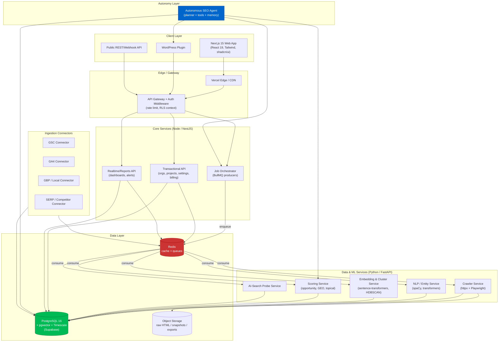
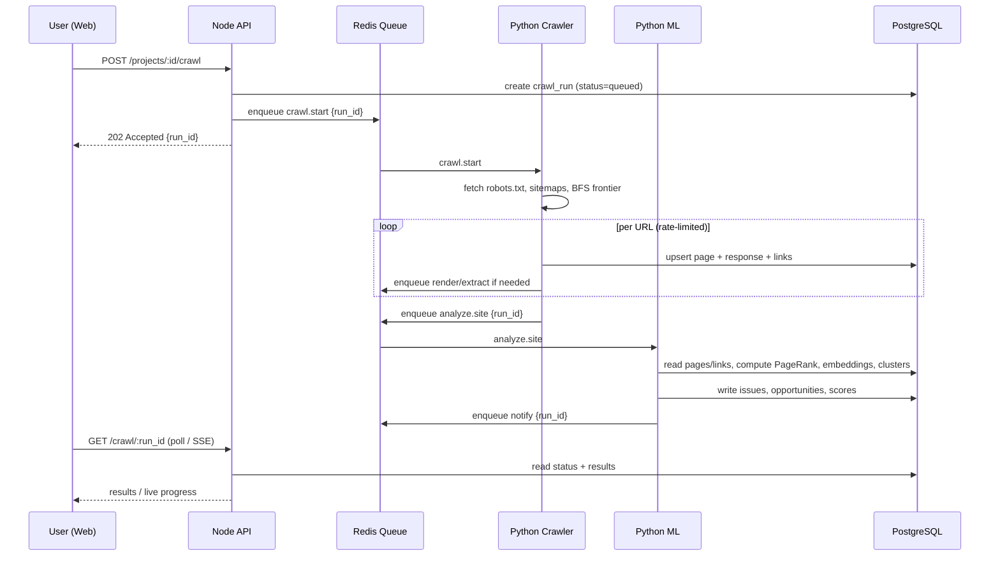
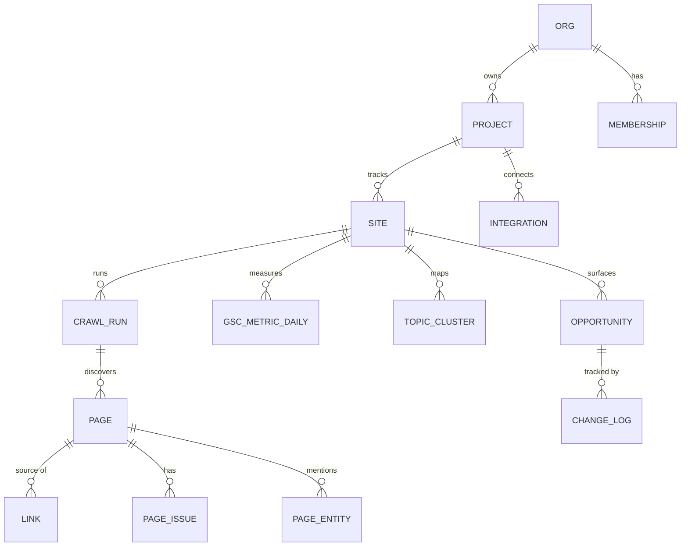

# Phase 2 — System Architecture

> A polyglot, service-oriented architecture: TypeScript for the product surface and
> transactional API, Python for crawling/NLP/ML, PostgreSQL as the source of truth,
> Redis-backed queues for distributed work, and a clean separation between
> **truth ingestion**, **analysis**, and **action**.

---

## 2.1 Architecture principles

1. **Truth is sacred and immutable.** Raw GSC/GA4/crawl data is stored append-only; derived metrics are recomputable.
2. **CPU-bound work is asynchronous.** Crawling, rendering, embedding, and scoring run in queues, never in request paths.
3. **Right language for the job.** Node for IO-bound realtime/transactional APIs; Python for ML/NLP/crawl ecosystems.
4. **Multi-tenant by default.** Row-Level Security (RLS) on every table keyed by `org_id`.
5. **Idempotent, resumable jobs.** Every job has a deterministic key; re-runs never double-write.
6. **Observability first.** Structured logs, traces, and per-job metrics from day one.

---

## 2.2 High-level system diagram

---

## 2.3 Component decisions and rationale ("WHY")

### Frontend — Next.js 15 (App Router) + React 19 + TypeScript
- **Why:** Server Components + streaming render large SEO dashboards fast; React Server Actions simplify mutations; first-class Vercel deploy; mature ecosystem (TanStack Query, Recharts/visx, shadcn/ui).
- **Why not pure SPA:** SEO data tables and graph visualizations are heavy; SSR/streaming + edge caching keep TTFB low and avoid shipping massive client bundles.

### Transactional / Realtime API — Node.js (NestJS)
- **Why Node:** The product API is overwhelmingly IO-bound (DB, Redis, third-party APIs). Node's event loop excels here and shares TypeScript types with the frontend (end-to-end type safety via a shared `packages/contracts`).
- **Why NestJS:** Opinionated DI, modules, guards (auth/RLS), and OpenAPI generation — enterprise structure without boilerplate sprawl.

### Data & ML services — Python (FastAPI)
- **Why Python:** The crawling (Playwright, httpx, lxml, trafilatura), NLP (spaCy, Hugging Face transformers), embeddings (sentence-transformers), clustering (HDBSCAN, UMAP, scikit-learn), and data (pandas/polars) ecosystems are unmatched. Forcing this into Node would be self-sabotage.
- **Why FastAPI:** Async, Pydantic-validated, auto-OpenAPI; pairs naturally with Celery/Arq workers.
- **Separation of concerns:** Node owns *the product*; Python owns *the intelligence*. They communicate via the queue (async jobs) and internal HTTP (sync queries) with shared contracts.

### Database — PostgreSQL 16 + pgvector + TimescaleDB (via Supabase)
- **Why Postgres:** One engine for relational integrity, JSONB flexibility, full-text search, **vector similarity (pgvector)** for semantic gap analysis, and **time-series (Timescale hypertables)** for GSC daily metrics — avoiding a 4-database zoo early on.
- **Why Supabase:** Managed Postgres + **Auth** (Google OAuth for GSC/GA4 scopes) + **RLS** (multi-tenant isolation enforced in the DB) + Storage + realtime — collapses 4 vendors into one and accelerates time-to-market.
- **Scaling path:** When GSC volume explodes, move time-series to a dedicated Timescale/ClickHouse cluster; keep relational/vector in Supabase. The schema is designed for this split (see Phase 4).

### Queue — Redis + BullMQ (Node) / Arq or Celery (Python)
- **Why:** Crawls and analyses are long-running, bursty, and must be retried, rate-limited, and prioritized per tenant. Redis-backed queues give durable jobs, concurrency control, delayed/cron jobs, and per-domain politeness throttling.
- **Why Redis (not SQS/Kafka) initially:** Already needed for caching; lowest operational overhead; BullMQ/Arq give rich semantics. Kafka is reserved for later if event volume warrants a true log.

### Cache — Redis
- **Why:** Hot dashboard aggregates, GSC API quota counters, dedup/seen-URL sets (Bloom-style), rate-limit tokens, and short-lived SERP results. Single Redis cluster serves cache + queue + locks.

### Storage — Supabase Storage / S3-compatible
- **Why:** Raw HTML, rendered DOM snapshots, screenshots, and large CSV/PDF exports don't belong in Postgres. Object storage is cheap, content-addressed (hash keys enable dedup + diffing for competitor change detection).

### Auth — Supabase Auth + Google OAuth
- **Why:** Need Google OAuth anyway for GSC/GA4/GBP scopes; Supabase Auth issues JWTs that drive Postgres RLS — auth and authorization share one trust model. Org/role/seat management layered on top.

### Containerization — Docker
- **Why:** Python ML services have heavy, version-sensitive native deps (Playwright browsers, spaCy models, CUDA optional). Docker guarantees reproducible builds across dev/CI/prod and clean horizontal scaling of workers.

### CI/CD — GitHub Actions
- **Why:** Repo-native; matrix builds for Node + Python; lint/typecheck/test gates; build & push images to registry; deploy web to Vercel and services to Fly.io/Railway/ECS; run DB migrations as a gated step.

### Deployment topology
- **Web:** Vercel (edge + SSR).
- **Node APIs:** Fly.io / Railway / AWS ECS Fargate (autoscaled).
- **Python workers:** Containerized worker pools (autoscaled by queue depth), separate pools for crawl vs. ML (different CPU/RAM profiles).
- **DB/Cache/Storage:** Supabase (Postgres) + managed Redis (Upstash/Elasticache) + S3/Supabase Storage.

---

## 2.4 Request & job flow (sequence)

---

## 2.5 Data layer logical model (overview)

Full physical schemas live in each engine's phase doc (Phase 3 crawl, Phase 4 GSC, Phase 5 topics).

---

## 2.6 Cross-cutting concerns

| Concern | Approach |
|---|---|
| **Multi-tenancy** | `org_id` on every row; Postgres RLS policies; JWT claims set `request.org`. |
| **Secrets** | OAuth refresh tokens encrypted at rest (KMS/pgcrypto); never logged. |
| **Rate limiting** | Per-domain crawl politeness + per-tenant API quota in Redis token buckets; respect GSC/GA4 API quotas with backoff. |
| **Idempotency** | Job keys = hash(tenant, entity, params); upserts everywhere. |
| **Observability** | OpenTelemetry traces across Node↔Python; structured JSON logs; queue-depth + job-latency metrics; Sentry for errors. |
| **Cost control** | LLM calls metered per org; embeddings cached by content hash; crawl budgets per plan tier. |
| **Compliance** | GDPR data residency option; per-tenant data export/delete; honor robots.txt + crawl-delay. |

---

## 2.7 Why this beats a monolith or a single-language stack

- A **Node-only** stack would force re-implementing the Python crawl/NLP/ML ecosystem — slow and inferior.
- A **Python-only** stack gives a weaker realtime/web/typesafe-frontend story and worse Vercel ergonomics.
- A **monolith** couples bursty CPU-bound ML with latency-sensitive APIs; queue + service split lets each scale independently (crawl pool scales on queue depth; API scales on RPS).

This architecture is intentionally boring where it should be (Postgres, Redis, Docker) and
sharp where it matters (closed-loop truth graph + autonomous action), which is exactly what a
production SEO Operating System needs.
