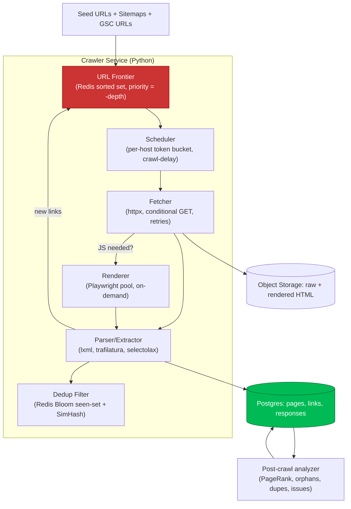
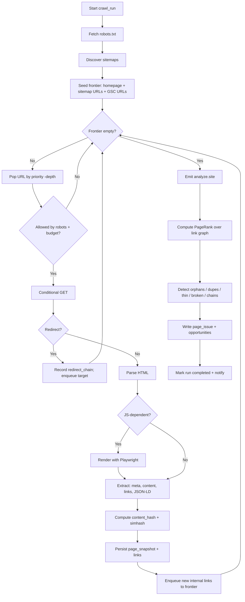

# Phase 3 — SEO Crawler Engine

> A distributed, polite, render-aware crawler that turns a website into a queryable
> **site graph** with full technical-SEO signals. Built in Python (httpx + Playwright),
> orchestrated via Redis queues, persisted to PostgreSQL.

---

## 3.1 Capabilities

| Capability | How it's done |
|---|---|
| URL discovery | BFS frontier from seeds + sitemap URLs + discovered `<a href>` + canonical/hreflang targets. |
| XML sitemap reading | Recursive parse of sitemap index → child sitemaps; capture `lastmod`, `priority`, image/news/video extensions. |
| robots.txt parsing | Honor `Disallow`/`Allow`/`Crawl-delay`/`Sitemap`; per-user-agent rules; store directives. |
| Canonical detection | `<link rel=canonical>`, HTTP `Link` header, and self-vs-cross canonical classification. |
| Redirect detection | Follow + record full redirect chains, status, hop count, loops, and chain-to-canonical mismatch. |
| Orphan page detection | Pages in sitemap/GSC but with **0 internal inlinks** in the crawl graph. |
| Duplicate content | SimHash/MinHash near-duplicate clustering on main-content text + exact title/H1/meta dupes. |
| Thin content | Main-content word count + content-to-template ratio + low unique-token density thresholds. |
| Internal link measurement | Inlink/outlink counts, anchor text, link position (nav/body/footer), follow/nofollow, computed PageRank. |
| Broken link detection | 4xx/5xx targets (internal + external), soft-404 heuristics. |
| Crawl depth | Shortest click-distance from each seed/homepage (BFS level). |
| Render parity | Optional headless render; diff raw-HTML vs rendered DOM to flag JS-dependent content/links. |
| Technical signals | Status, indexability, meta robots, hreflang clusters, structured data (JSON-LD) extraction + validation, Core Web Vitals (CrUX join + lab via Lighthouse). |

---

## 3.2 Crawler architecture



### Politeness & scale
- **Per-host concurrency** + `Crawl-delay` enforced via Redis token buckets keyed by host.
- **Conditional GET** (`ETag`/`If-Modified-Since`) to avoid re-downloading unchanged pages between runs.
- **Crawl budget** per plan tier (max URLs, max depth, render quota).
- **Resumable**: frontier + seen-set persisted in Redis; a crashed worker's claimed URLs return to the frontier via visibility timeout.

---

## 3.3 Database schema (crawl domain)

```sql
-- ============ SITES & RUNS ============
CREATE TABLE site (
    id              UUID PRIMARY KEY DEFAULT gen_random_uuid(),
    project_id      UUID NOT NULL REFERENCES project(id) ON DELETE CASCADE,
    org_id          UUID NOT NULL,                       -- RLS key
    domain          TEXT NOT NULL,
    base_url        TEXT NOT NULL,
    crawl_settings  JSONB NOT NULL DEFAULT '{}',         -- max_depth, render, ua, budgets
    created_at      TIMESTAMPTZ NOT NULL DEFAULT now(),
    UNIQUE (project_id, domain)
);

CREATE TABLE crawl_run (
    id              UUID PRIMARY KEY DEFAULT gen_random_uuid(),
    site_id         UUID NOT NULL REFERENCES site(id) ON DELETE CASCADE,
    org_id          UUID NOT NULL,
    status          TEXT NOT NULL DEFAULT 'queued',      -- queued|running|completed|failed|cancelled
    trigger         TEXT NOT NULL DEFAULT 'manual',      -- manual|scheduled|agent
    started_at      TIMESTAMPTZ,
    finished_at     TIMESTAMPTZ,
    stats           JSONB NOT NULL DEFAULT '{}',         -- urls_found, fetched, errors, avg_ms
    config_snapshot JSONB NOT NULL DEFAULT '{}',
    created_at      TIMESTAMPTZ NOT NULL DEFAULT now()
);

-- ============ PAGES ============
CREATE TABLE page (
    id                UUID PRIMARY KEY DEFAULT gen_random_uuid(),
    site_id           UUID NOT NULL REFERENCES site(id) ON DELETE CASCADE,
    org_id            UUID NOT NULL,
    url               TEXT NOT NULL,
    url_hash          BYTEA NOT NULL,                    -- sha256(normalized_url) for fast lookup
    first_seen_run    UUID REFERENCES crawl_run(id),
    last_seen_run     UUID REFERENCES crawl_run(id),
    UNIQUE (site_id, url_hash)
);

-- Per-run snapshot of a page's state (append-only history => diffs over time)
CREATE TABLE page_snapshot (
    id                UUID PRIMARY KEY DEFAULT gen_random_uuid(),
    page_id           UUID NOT NULL REFERENCES page(id) ON DELETE CASCADE,
    crawl_run_id      UUID NOT NULL REFERENCES crawl_run(id) ON DELETE CASCADE,
    org_id            UUID NOT NULL,
    status_code       INT,
    content_type      TEXT,
    fetched_at        TIMESTAMPTZ NOT NULL DEFAULT now(),
    response_ms       INT,
    -- indexability
    indexable         BOOLEAN,
    noindex           BOOLEAN,
    canonical_url     TEXT,
    is_self_canonical BOOLEAN,
    robots_directives TEXT,
    -- content
    title             TEXT,
    meta_description  TEXT,
    h1                TEXT,
    word_count        INT,
    content_ratio     NUMERIC(5,4),                      -- main content / total tokens
    lang              TEXT,
    content_hash      BYTEA,                             -- exact-dupe detection
    simhash           BIGINT,                            -- near-dupe detection
    -- structure
    depth             INT,                               -- BFS click distance
    inlink_count      INT DEFAULT 0,
    outlink_count     INT DEFAULT 0,
    internal_inlinks  INT DEFAULT 0,
    pagerank          NUMERIC(10,8),
    -- payload pointers
    raw_html_key      TEXT,                              -- object storage
    rendered_html_key TEXT,
    structured_data   JSONB,                             -- extracted JSON-LD
    cwv               JSONB,                             -- {lcp, inp, cls, source}
    flags             JSONB NOT NULL DEFAULT '{}'        -- thin, orphan, soft404, render_gap...
);
SELECT create_hypertable('page_snapshot', 'fetched_at', if_not_exists => TRUE);
CREATE INDEX ON page_snapshot (org_id, crawl_run_id);
CREATE INDEX ON page_snapshot (page_id, fetched_at DESC);
CREATE INDEX ON page_snapshot (simhash);

-- ============ LINKS (the graph edges) ============
CREATE TABLE link (
    id              UUID PRIMARY KEY DEFAULT gen_random_uuid(),
    crawl_run_id    UUID NOT NULL REFERENCES crawl_run(id) ON DELETE CASCADE,
    org_id          UUID NOT NULL,
    src_page_id     UUID NOT NULL REFERENCES page(id) ON DELETE CASCADE,
    dst_url         TEXT NOT NULL,
    dst_page_id     UUID REFERENCES page(id),            -- null if external/unresolved
    anchor_text     TEXT,
    rel             TEXT,                                -- nofollow, sponsored, ugc
    is_internal     BOOLEAN NOT NULL,
    position        TEXT,                                -- nav|body|footer|sidebar
    dst_status      INT,                                 -- resolved target status (broken if 4xx/5xx)
    created_at      TIMESTAMPTZ NOT NULL DEFAULT now()
);
CREATE INDEX ON link (org_id, src_page_id);
CREATE INDEX ON link (org_id, dst_page_id);
CREATE INDEX ON link (crawl_run_id, is_internal);

-- ============ REDIRECTS ============
CREATE TABLE redirect_chain (
    id            UUID PRIMARY KEY DEFAULT gen_random_uuid(),
    crawl_run_id  UUID NOT NULL REFERENCES crawl_run(id) ON DELETE CASCADE,
    org_id        UUID NOT NULL,
    start_url     TEXT NOT NULL,
    hops          JSONB NOT NULL,                        -- [{url,status},...]
    final_url     TEXT,
    final_status  INT,
    hop_count     INT,
    has_loop      BOOLEAN DEFAULT FALSE
);

-- ============ TECHNICAL ISSUES ============
CREATE TABLE page_issue (
    id            UUID PRIMARY KEY DEFAULT gen_random_uuid(),
    crawl_run_id  UUID NOT NULL REFERENCES crawl_run(id) ON DELETE CASCADE,
    org_id        UUID NOT NULL,
    page_id       UUID REFERENCES page(id) ON DELETE CASCADE,
    issue_type    TEXT NOT NULL,    -- orphan|thin|dup_content|broken_link|redirect_chain|
                                    -- canonical_conflict|missing_title|noindex_in_sitemap|render_gap|...
    severity      TEXT NOT NULL,    -- critical|high|medium|low
    details       JSONB NOT NULL DEFAULT '{}',
    detected_at   TIMESTAMPTZ NOT NULL DEFAULT now()
);
CREATE INDEX ON page_issue (org_id, crawl_run_id, severity);
CREATE INDEX ON page_issue (org_id, issue_type);
```

> **Design note:** `page` is the stable identity; `page_snapshot` is the time-series of its
> state. This gives free historical diffing (Phase 8 competitor change detection reuses the
> same pattern) and lets us compute "what changed since last crawl" with a single window query.

---

## 3.4 API structure (crawler)

REST (NestJS gateway proxying Python crawler) — all routes scoped to an authenticated org.

```
POST   /v1/sites/:siteId/crawls                 # start a crawl (body: {maxDepth,render,budget})
GET    /v1/sites/:siteId/crawls                  # list runs
GET    /v1/crawls/:runId                         # run status + stats (supports SSE ?stream=1)
POST   /v1/crawls/:runId/cancel
GET    /v1/crawls/:runId/pages?status=&depth=&flag=&page=   # paginated page list
GET    /v1/crawls/:runId/pages/:pageId           # single page snapshot + links
GET    /v1/crawls/:runId/issues?type=&severity=  # technical issues
GET    /v1/crawls/:runId/links?internal=true&broken=true
GET    /v1/crawls/:runId/graph                   # site graph (nodes+edges) for viz
GET    /v1/crawls/:runId/orphans
GET    /v1/crawls/:runId/duplicates              # near-dup clusters
GET    /v1/sites/:siteId/diff?from=runA&to=runB  # structural diff between runs
```

Internal service contract (Node → Python, async via queue):

```jsonc
// queue: crawl.start
{ "run_id": "uuid", "site_id": "uuid", "org_id": "uuid",
  "seeds": ["https://example.com/"],
  "config": { "max_depth": 10, "max_urls": 50000, "render": "auto",
              "user_agent": "GOAAISEO-bot/1.0", "respect_robots": true } }

// queue: analyze.site  (emitted when crawl frontier drains)
{ "run_id": "uuid", "site_id": "uuid", "org_id": "uuid",
  "tasks": ["pagerank","orphans","duplicates","thin","issues","embeddings"] }
```

---

## 3.5 Crawl workflow



### Post-crawl analysis algorithms (summary)

```python
# Orphan detection: in known-URL set (sitemap ∪ GSC) but internal_inlinks == 0
orphans = pages.filter(internal_inlinks=0).intersect(known_urls)

# Near-duplicate clustering via SimHash Hamming distance
def near_dupes(snapshots, max_hamming=3):
    buckets = lsh_bucket_by_simhash(snapshots)          # banding for O(n) candidate gen
    return union_find([(a, b) for a, b in candidate_pairs(buckets)
                       if hamming(a.simhash, b.simhash) <= max_hamming])

# Internal PageRank (iterative, damping=0.85) over the internal link subgraph
def pagerank(graph, d=0.85, iters=40):
    N = len(graph.nodes); pr = {n: 1/N for n in graph.nodes}
    for _ in range(iters):
        nxt = {n: (1-d)/N for n in graph.nodes}
        for u in graph.nodes:
            out = graph.out_neighbors(u) or graph.nodes  # dangling -> distribute to all
            share = pr[u] / len(out)
            for v in out: nxt[v] += d * share
        pr = nxt
    return pr
```

Outputs from this phase feed Phase 5 (topical authority), Phase 6 (AI-search: schema/E-E-A-T
signals), and Phase 9 (internal-linking AI) directly off the persisted site graph.
