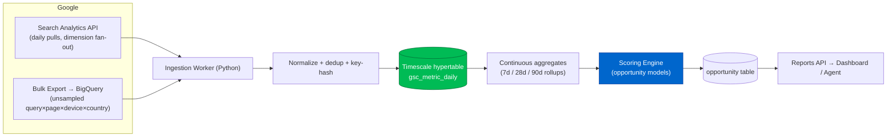

# Phase 4 — Search Console Intelligence

> The ground-truth core. We ingest Google Search Console at full granularity, store it as
> time-series, and run scoring models that surface what the GSC UI mathematically hides:
> CTR opportunities, impression growth, ranking loss, cannibalization, and AI/snippet openings.

---

## 4.1 Why this is the heart of GOAAISEO

GSC is the only source of *your actual* impressions, clicks, position, and queries. But the
product GSC ships is deliberately limited:

- 16-month retention; 1,000-row UI cap; sampling on high-cardinality reports.
- **Query↔Page pairs are hidden** when you filter — the single most valuable join for cannibalization.
- No scoring, no prioritization, no recommendations, no cross-tool joins.

GOAAISEO fixes all of this by pulling via the **Search Analytics API** *and* **Bulk Data Export**
(BigQuery) for unsampled, query×page×device×country×date rows, then storing them in our own
time-series store for unlimited retention and arbitrary joins.

---

## 4.2 Ingestion pipeline



### Ingestion mechanics
- **Backfill:** on connect, pull the full 16 months available + enable Bulk Export going forward (Bulk Export has no 16-month limit once running → we accumulate *beyond* Google's retention).
- **Daily delta:** pull `date - 3` (Google finalizes data with ~2–3 day lag) and re-pull a trailing 5-day window to catch revisions.
- **Dimension fan-out:** separate pulls for `[date]`, `[date,query]`, `[date,page]`, `[date,query,page]`, `[date,page,device]`, `[date,page,country]` — respecting the 25k-row/request limit with pagination + date chunking.
- **Quota safety:** Redis token bucket per GSC property; exponential backoff on 429/403.

---

## 4.3 Database schema (GSC domain)

```sql
-- Raw daily ground truth (hypertable, append-only). One row per dimension combo per day.
CREATE TABLE gsc_metric_daily (
    org_id        UUID NOT NULL,
    site_id       UUID NOT NULL,
    date          DATE NOT NULL,
    query         TEXT,                 -- nullable when not in dimension set
    page          TEXT,
    device        TEXT,                 -- DESKTOP|MOBILE|TABLET
    country       TEXT,                 -- ISO-3166
    search_type   TEXT DEFAULT 'web',   -- web|image|video|news|discover
    clicks        INT  NOT NULL DEFAULT 0,
    impressions   INT  NOT NULL DEFAULT 0,
    ctr           NUMERIC(6,5),         -- clicks/impressions (stored for convenience)
    position      NUMERIC(6,2),         -- avg position
    dim_hash      BYTEA NOT NULL,       -- sha256(query|page|device|country|search_type)
    PRIMARY KEY (org_id, site_id, date, dim_hash)
);
SELECT create_hypertable('gsc_metric_daily', 'date', chunk_time_interval => INTERVAL '7 days');
CREATE INDEX ON gsc_metric_daily (org_id, site_id, page, date DESC);
CREATE INDEX ON gsc_metric_daily (org_id, site_id, query, date DESC);

-- Continuous aggregate: per page+query rolling 28-day window
CREATE MATERIALIZED VIEW gsc_pq_28d
WITH (timescaledb.continuous) AS
SELECT org_id, site_id, page, query,
       time_bucket('1 day', date) AS bucket,
       sum(clicks)      AS clicks,
       sum(impressions) AS impressions,
       avg(position)    AS position
FROM gsc_metric_daily
WHERE query IS NOT NULL AND page IS NOT NULL
GROUP BY org_id, site_id, page, query, bucket;

-- Derived opportunities (the actionable output)
CREATE TABLE opportunity (
    id            UUID PRIMARY KEY DEFAULT gen_random_uuid(),
    org_id        UUID NOT NULL,
    site_id       UUID NOT NULL,
    type          TEXT NOT NULL,   -- ctr_gap|impression_growth|ranking_loss|
                                   -- cannibalization|ai_overview|featured_snippet|striking_distance
    page          TEXT,
    query         TEXT,
    score         NUMERIC(7,3) NOT NULL,   -- prioritization score (0-100)
    est_click_lift INT,                    -- modeled monthly incremental clicks
    evidence      JSONB NOT NULL,          -- metrics that justify it (explainability)
    status        TEXT NOT NULL DEFAULT 'open', -- open|in_progress|done|dismissed
    detected_at   TIMESTAMPTZ NOT NULL DEFAULT now(),
    window_days   INT NOT NULL DEFAULT 28
);
CREATE INDEX ON opportunity (org_id, site_id, type, score DESC);
CREATE INDEX ON opportunity (org_id, status);

-- Expected CTR curve by position (per-site calibrated, falls back to global prior)
CREATE TABLE ctr_curve (
    org_id    UUID NOT NULL,
    site_id   UUID NOT NULL,
    position  INT  NOT NULL,           -- 1..20
    expected_ctr NUMERIC(6,5) NOT NULL,
    sample_n  INT NOT NULL,
    PRIMARY KEY (org_id, site_id, position)
);
```

---

## 4.4 Processing logic & scoring models

All scores are **explainable**: every `opportunity.evidence` stores the exact metrics so the UI
and agent can say *"why this, why now, expected lift."*

### 4.4.1 CTR Opportunity (you rank well but under-earn clicks)

```python
def ctr_opportunities(site, window=28):
    rows = agg_by_page_query(site, window)          # clicks, impr, avg_position
    curve = ctr_curve_for(site)                     # calibrated expected CTR by position
    out = []
    for r in rows:
        if r.impressions < MIN_IMPRESSIONS:          # noise floor, e.g. 100
            continue
        exp_ctr = curve.expected(round(r.position))
        gap = exp_ctr - r.ctr                         # positive => underperforming
        if gap > CTR_GAP_THRESHOLD and r.position <= 15:
            est_lift = gap * r.impressions            # incremental clicks if CTR normalizes
            score = norm100(est_lift) * confidence(r.impressions)
            out.append(Opportunity('ctr_gap', r.page, r.query, score,
                        est_click_lift=int(est_lift),
                        evidence={'position': r.position, 'ctr': r.ctr,
                                  'expected_ctr': exp_ctr, 'impressions': r.impressions}))
    return out
# Action: rewrite title/meta/structured data to lift CTR; re-measured post-deploy (Phase 11 loop).
```

### 4.4.2 Striking-distance / Impression-growth

```python
def striking_distance(site, window=28):
    # Pages ranking 8-20 with rising impressions = cheap wins from small position gains
    rows = agg_by_page_query(site, window)
    prev = agg_by_page_query(site, window, offset=window)   # prior period
    out = []
    for r in rows:
        if 8 <= r.position <= 20 and r.impressions >= MIN_IMPRESSIONS:
            impr_slope = trend_slope(r.page, r.query, window)   # linear regression on daily impr
            demand_growth = (r.impressions - prev.get(r.key, 0)) / max(prev.get(r.key,1),1)
            score = norm100(r.impressions) * (1 + max(demand_growth,0)) * proximity_weight(r.position)
            out.append(Opportunity('striking_distance', r.page, r.query, score,
                        evidence={'position': r.position, 'impr_slope': impr_slope,
                                  'demand_growth': demand_growth}))
    return out
```

### 4.4.3 Ranking-loss / Decay detection

```python
def ranking_loss(site, window=28, drop=3.0):
    cur  = agg_by_page_query(site, window)
    base = agg_by_page_query(site, window, offset=window)
    out = []
    for k, c in cur.items():
        b = base.get(k)
        if not b or b.impressions < MIN_IMPRESSIONS:
            continue
        pos_delta   = c.position - b.position          # positive = worse
        click_delta = c.clicks   - b.clicks
        if pos_delta >= drop or click_delta <= -CLICK_DROP:
            severity = 'critical' if pos_delta >= 5 else 'high'
            score = norm100(abs(click_delta)) * (1 + pos_delta/10)
            out.append(Opportunity('ranking_loss', c.page, c.query, score,
                        evidence={'pos_before': b.position, 'pos_after': c.position,
                                  'click_delta': click_delta, 'severity': severity}))
    return out
```

### 4.4.4 Cannibalization detection (the join GSC hides)

```python
def cannibalization(site, window=28):
    # For each query, find multiple URLs receiving impressions => competing for the same intent.
    by_query = group_pages_per_query(site, window)
    out = []
    for query, pages in by_query.items():
        ranked = [p for p in pages if p.impressions >= MIN_IMPRESSIONS]
        if len(ranked) < 2:
            continue
        # Flag when no single page dominates (click share spread) OR positions swap over time
        share = click_share(ranked)
        swaps = url_position_swaps(query, window)       # detects flip-flopping in serp
        if max(share.values()) < DOMINANCE_THRESHOLD or swaps > 0:
            primary = pick_primary(ranked)              # highest clicks * topical fit
            score = norm100(sum(p.impressions for p in ranked)) * (1 - max(share.values()))
            out.append(Opportunity('cannibalization', primary.page, query, score,
                        evidence={'competing_urls': [p.page for p in ranked],
                                  'click_share': share, 'serp_swaps': swaps,
                                  'recommended_primary': primary.page}))
    return out
# Action: consolidate/canonicalize/internal-link toward the primary URL; de-optimize duplicates.
```

### 4.4.5 AI-Overview & Featured-Snippet opportunity

```python
def serp_feature_opportunities(site, window=28):
    rows = agg_by_page_query(site, window)
    out = []
    for r in rows:
        intent = classify_intent(r.query)              # informational/question patterns
        has_qa_structure = page_has_extractable_answer(r.page)  # from crawl: H2/Q, lists, schema
        # Featured snippet: ranking 1-8 on a question/definition query but not winning the box
        if r.position <= 8 and intent in ('question','definition','how_to'):
            score = norm100(r.impressions) * (1.2 if not has_qa_structure else 0.8)
            out.append(Opportunity('featured_snippet', r.page, r.query, score,
                        evidence={'intent': intent, 'position': r.position,
                                  'has_qa_structure': has_qa_structure}))
        # AI Overview: high-impression informational query where AIO likely triggers
        if intent == 'informational' and r.impressions >= AIO_IMPR and impressions_with_low_ctr(r):
            score = norm100(r.impressions) * aio_likelihood(r.query)
            out.append(Opportunity('ai_overview', r.page, r.query, score,
                        evidence={'intent': intent, 'ctr': r.ctr,
                                  'note': 'low CTR at strong position suggests AIO/zero-click'}))
    return out
# Bridges into Phase 6 (AI search optimization) for the actual extractability fixes.
```

---

## 4.5 Scoring model — unified prioritization

Every opportunity is normalized to a single **Priority Score (0–100)** so the agent and UI can rank a mixed backlog:

```
PriorityScore = 100 * w_impact * w_confidence * w_effort_inverse * w_strategic

where
  impact      = normalized estimated incremental clicks/conversions (uses GA4 value if available)
  confidence  = f(impressions volume, data recency, trend stability)   ∈ [0,1]
  effort_inv  = 1 / estimated_effort (title edit > content rewrite > technical migration)
  strategic   = topical-authority weight (Phase 5): boosts opportunities in priority clusters
```

Weights are tunable per org and **learned over time** from the closed-loop attribution dataset
(Phase 11): action types that historically produced lift on similar sites get up-weighted.

---

## 4.6 Reports API

```
GET /v1/sites/:siteId/gsc/summary?range=28d
GET /v1/sites/:siteId/opportunities?type=ctr_gap&min_score=50&sort=score
GET /v1/sites/:siteId/queries?page=/blog/x&range=90d        # the hidden query×page join
GET /v1/sites/:siteId/cannibalization
GET /v1/sites/:siteId/decay?range=28d&compare=prev
GET /v1/sites/:siteId/pages/:pageUrl/timeseries?metric=clicks&range=16m
POST /v1/sites/:siteId/gsc/sync                              # force re-pull window
```

These outputs are the agent's primary "sensor" input (Phase 11) and the dashboard's headline
modules. Combined with the site graph (Phase 3) and topic model (Phase 5), they form the
Ground-Truth Graph that is GOAAISEO's core moat.
