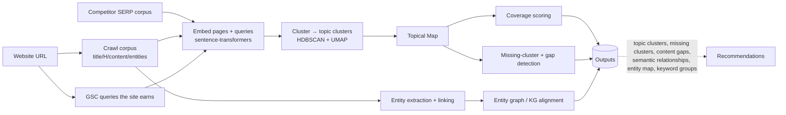
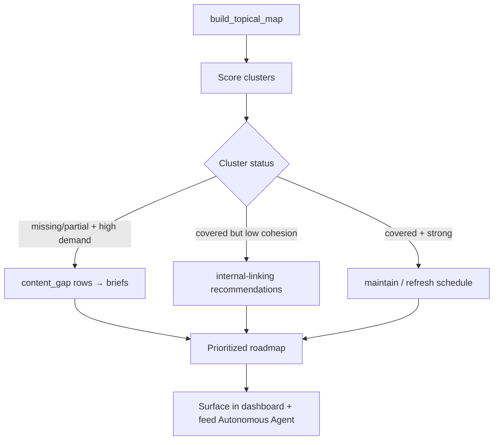

# Phase 5 — Topical Authority Engine

> Turns a website (URL in) into a semantic map (clusters, gaps, entities, relationships out).
> Combines crawl content + GSC query demand + embeddings + graph clustering to quantify
> *topical authority* and pinpoint exactly what to build next.

---

## 5.1 Problem definition

Modern ranking rewards demonstrated **topical authority** — comprehensive, interlinked coverage
of a subject — not isolated keyword-stuffed pages. The engine must answer:

1. What topics does this site *actually* cover (from its content + the queries it earns)?
2. How well does it cover each topic (depth, breadth, internal-link cohesion)?
3. What clusters are **missing** vs. the topic's full subtopic space and vs. competitors?
4. What's the highest-ROI next content to close authority gaps?

---

## 5.2 Inputs & outputs



| Output | Definition |
|---|---|
| **Topic clusters** | Embedding-based groups of pages+queries representing coherent subjects. |
| **Missing clusters** | Subtopics in the domain's expected ontology / competitor space with no covering page. |
| **Content gaps** | Queries the site gets impressions for (or competitors rank for) with weak/no dedicated page. |
| **Semantic relationships** | Parent/child/sibling/related edges between clusters (the topical graph). |
| **Entity mapping** | Named entities per page linked to Wikidata/KG IDs; entity coverage per cluster. |
| **Keyword grouping** | GSC queries grouped to clusters/pages by semantic + intent similarity. |

---

## 5.3 Data model

```sql
CREATE TABLE topic_cluster (
    id           UUID PRIMARY KEY DEFAULT gen_random_uuid(),
    org_id       UUID NOT NULL,
    site_id      UUID NOT NULL,
    label        TEXT NOT NULL,              -- human label (LLM-generated from members)
    centroid     VECTOR(768) NOT NULL,       -- pgvector cluster centroid
    parent_id    UUID REFERENCES topic_cluster(id),  -- topical hierarchy
    pillar_page_id UUID,                      -- chosen pillar/hub page
    coverage_score NUMERIC(5,2),              -- 0-100
    authority_score NUMERIC(5,2),             -- 0-100 (coverage * cohesion * performance)
    member_count INT DEFAULT 0,
    status       TEXT DEFAULT 'covered',      -- covered|partial|missing
    created_at   TIMESTAMPTZ DEFAULT now()
);

CREATE TABLE page_embedding (
    page_id   UUID PRIMARY KEY REFERENCES page(id) ON DELETE CASCADE,
    org_id    UUID NOT NULL,
    site_id   UUID NOT NULL,
    embedding VECTOR(768) NOT NULL,
    content_hash BYTEA NOT NULL,             -- cache key: re-embed only when content changes
    cluster_id UUID REFERENCES topic_cluster(id)
);
CREATE INDEX ON page_embedding USING hnsw (embedding vector_cosine_ops);

CREATE TABLE entity (
    id         UUID PRIMARY KEY DEFAULT gen_random_uuid(),
    org_id     UUID NOT NULL,
    name       TEXT NOT NULL,
    kg_id      TEXT,                          -- Wikidata QID / Google KG MID
    type       TEXT,                          -- Person|Org|Product|Place|Concept...
    embedding  VECTOR(768)
);

CREATE TABLE page_entity (
    page_id    UUID NOT NULL REFERENCES page(id) ON DELETE CASCADE,
    entity_id  UUID NOT NULL REFERENCES entity(id),
    org_id     UUID NOT NULL,
    salience   NUMERIC(5,4),                  -- importance of entity on the page
    mentions   INT,
    PRIMARY KEY (page_id, entity_id)
);

CREATE TABLE content_gap (
    id          UUID PRIMARY KEY DEFAULT gen_random_uuid(),
    org_id      UUID NOT NULL,
    site_id     UUID NOT NULL,
    cluster_id  UUID REFERENCES topic_cluster(id),
    gap_type    TEXT NOT NULL,                -- missing_cluster|missing_subtopic|weak_page|missing_entity
    target_query TEXT,
    rationale   JSONB NOT NULL,               -- demand, competitor coverage, expected lift
    priority    NUMERIC(7,3),
    status      TEXT DEFAULT 'open'
);
```

---

## 5.4 Core algorithm

```python
def build_topical_map(site):
    # 1. Gather corpus: pages (crawl) + queries (GSC) + optional competitor SERP docs
    pages   = load_pages_with_content(site)
    queries = load_gsc_queries(site, window=90)            # ground-truth demand
    comp    = load_competitor_serp_corpus(site)            # what others rank for

    # 2. Embed everything in a shared space (cache by content_hash)
    page_vecs  = embed([p.main_content for p in pages], cache=True)
    query_vecs = embed([q.text for q in queries])

    # 3. Dimensionality reduction + density clustering (no fixed K)
    reduced = umap(np.vstack([page_vecs, query_vecs]), n_components=15, metric='cosine')
    labels  = hdbscan(reduced, min_cluster_size=5, metric='euclidean')

    # 4. Materialize clusters, centroids, and LLM labels
    clusters = {}
    for item, lab in zip(pages + queries, labels):
        if lab == -1:                                       # noise → candidate orphan topic
            continue
        clusters.setdefault(lab, []).append(item)
    topic_map = []
    for lab, members in clusters.items():
        centroid = mean_vector(members)
        label    = llm_label_cluster(top_terms(members), examples(members))
        pillar   = pick_pillar_page(members)                # highest pagerank * coverage
        topic_map.append(Cluster(label, centroid, members, pillar))

    # 5. Build hierarchy: link clusters by centroid similarity (parent = broader, more pages)
    link_cluster_hierarchy(topic_map)                       # cosine kNN + breadth heuristic

    # 6. Score coverage & authority per cluster
    for c in topic_map:
        c.coverage  = coverage_score(c)                     # see 5.5
        c.authority = c.coverage * cohesion(c) * performance(c)  # perf from GSC clicks/impr
    return topic_map
```

### 5.4.1 Missing-cluster detection

```python
def find_missing_clusters(site, topic_map):
    # Strategy A — competitor delta: cluster the competitor corpus the same way;
    # any competitor cluster with no site page within cosine τ is a missing cluster.
    comp_clusters = cluster(load_competitor_serp_corpus(site))
    missing = []
    for cc in comp_clusters:
        nearest = max(topic_map, key=lambda c: cosine(c.centroid, cc.centroid))
        if cosine(nearest.centroid, cc.centroid) < TAU_COVERED:        # e.g. 0.78
            missing.append(MissingCluster(label=cc.label, demand=cc.demand,
                                          competitors=cc.domains))
    # Strategy B — ontology expansion: ask LLM/KG for the canonical subtopic set of each
    # pillar topic; subtopics with no covering page are missing subtopics.
    for c in topic_map:
        ontology = expand_subtopics(c.label)               # LLM + Wikidata properties
        for sub in ontology:
            if not covered_by_any_page(sub, site):
                missing.append(MissingCluster(label=sub, parent=c.label,
                                              demand=keyword_demand(sub)))
    return rank_by_priority(missing)                       # demand * competitor_strength * fit
```

### 5.4.2 Content-gap detection (query-level)

```python
def find_content_gaps(site, topic_map):
    gaps = []
    for q in load_gsc_queries(site, window=90):
        page = best_matching_page(q, topic_map)            # semantic nearest page
        if page is None or cosine(embed(q.text), page.embedding) < TAU_MATCH:
            gaps.append(Gap('missing_subtopic', q.text, demand=q.impressions))
        elif q.position > 10 and intent_specific(q) and not page.is_dedicated(q):
            # ranking a generic page for a specific query => needs a dedicated page
            gaps.append(Gap('weak_page', q.text, page=page.url, demand=q.impressions))
    return rank_by_priority(gaps)
```

### 5.4.3 Keyword grouping

```python
def group_keywords(site):
    queries = load_gsc_queries(site, window=90)
    vecs = embed([q.text for q in queries])
    groups = agglomerative(vecs, distance_threshold=0.25, linkage='average')
    for g in groups:
        g.intent = majority_intent([classify_intent(q.text) for q in g.members])
        g.target_page = assign_target_page(g)              # one URL per intent group (anti-cannibalization)
    return groups                                           # feeds Phase 4 cannibalization + Phase 9 linking
```

---

## 5.5 Coverage & authority scoring

```
coverage_score(cluster) = 100 * sigmoid(
        0.40 * breadth          # fraction of expected subtopics with a page
      + 0.25 * depth            # avg content depth/word-count vs SERP norm
      + 0.20 * entity_coverage  # share of cluster's key entities present
      + 0.15 * freshness )      # recency of updates in the cluster

cohesion(cluster)  = internal-link density among cluster pages / ideal hub-spoke density
performance(cluster) = normalized GSC clicks+impressions attributable to the cluster

authority_score = coverage_score * cohesion * performance    # rescaled to 0-100
```

A cluster with high coverage but low cohesion → **internal-linking action** (Phase 9).
A cluster with low coverage but high demand → **content-creation action** (brief generated by agent, Phase 11).

---

## 5.6 Output workflow



The topical map is recomputed incrementally: only re-embed pages whose `content_hash` changed,
then re-cluster affected regions. This keeps the map fresh after every crawl without full
recomputation, and the `strategic` weight it produces flows back into Phase 4's priority scoring.
