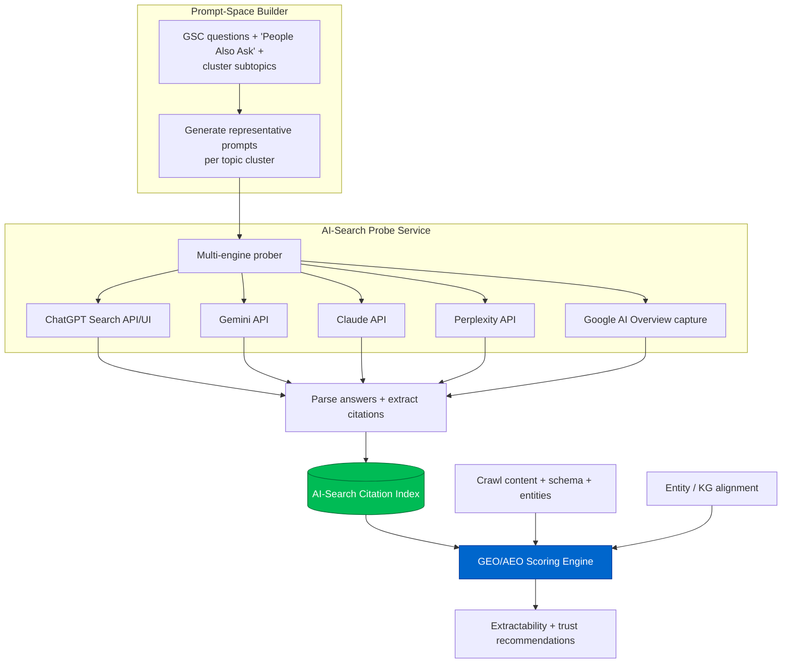
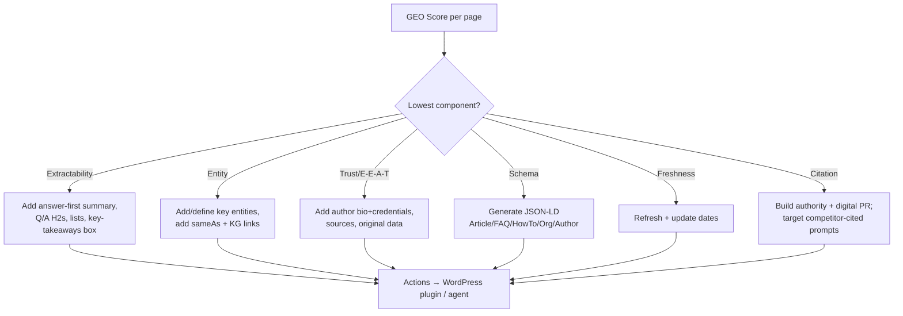

# Phase 6 — AI Search Optimization (GEO / AEO)

> The 2026 differentiator. Optimize and **measure** visibility inside generative engines —
> ChatGPT Search, Gemini, Claude, Perplexity, and Google AI Overviews — by treating
> *prompts* as the new keywords and *citations* as the new rankings.

---

## 6.1 Why classic SEO metrics break here

Generative engines don't return ten blue links; they synthesize an answer and (sometimes) cite
sources. The questions change from "what position do I rank?" to:

- Am I **cited** when a user asks about my topic? In which engines? How often?
- Is my content **extractable** — can a model lift a clean, attributable claim from my page?
- Do I carry the **trust/E-E-A-T and entity signals** these systems use to choose sources?

GOAAISEO builds a **prompt-space model** (analogous to keyword-space) and a **citation index**
(analogous to a rank tracker) across engines.

---

## 6.2 Architecture



---

## 6.3 What we detect

| Signal | Definition | Source |
|---|---|---|
| **Citation presence** | Is the domain/page cited in the engine's answer for a prompt? | Probe + parse |
| **Share of AI voice** | % of target prompts where you're cited vs. competitors. | Citation index |
| **Entity coverage** | Are the cluster's key entities present, defined, and linked to KG IDs? | Crawl + Phase 5 |
| **Answer extractability** | Can a model lift a clean, self-contained, attributable claim? | Content structure analysis |
| **Trust / E-E-A-T signals** | Author bylines+bios, credentials, citations/sources, freshness, `sameAs`, org schema, reviews. | Crawl + schema |
| **Citation opportunities** | Prompts where competitors are cited but you aren't, and you have/could have a strong page. | Index delta |
| **Knowledge-graph opportunities** | Missing/incomplete entity definitions, `sameAs`, Wikidata presence. | KG alignment |

---

## 6.4 Data model

```sql
CREATE TABLE ai_prompt (
    id          UUID PRIMARY KEY DEFAULT gen_random_uuid(),
    org_id      UUID NOT NULL,
    site_id     UUID NOT NULL,
    cluster_id  UUID REFERENCES topic_cluster(id),
    prompt      TEXT NOT NULL,
    intent      TEXT,                    -- informational|comparison|how_to|local|commercial
    source      TEXT,                    -- gsc_question|paa|cluster_expansion|manual
    created_at  TIMESTAMPTZ DEFAULT now()
);

CREATE TABLE ai_citation (
    id          UUID PRIMARY KEY DEFAULT gen_random_uuid(),
    org_id      UUID NOT NULL,
    site_id     UUID NOT NULL,
    prompt_id   UUID NOT NULL REFERENCES ai_prompt(id),
    engine      TEXT NOT NULL,           -- chatgpt|gemini|claude|perplexity|google_aio
    probed_at   TIMESTAMPTZ NOT NULL DEFAULT now(),
    cited_domain TEXT,                   -- domain found in citations
    cited_url   TEXT,
    is_self     BOOLEAN,                 -- belongs to tracked site
    rank_in_answer INT,                  -- order of citation
    answer_excerpt TEXT,
    raw_payload_key TEXT                 -- object storage: full answer snapshot
);
CREATE INDEX ON ai_citation (org_id, site_id, engine, probed_at DESC);
CREATE INDEX ON ai_citation (prompt_id, engine);

CREATE TABLE geo_score (
    id          UUID PRIMARY KEY DEFAULT gen_random_uuid(),
    org_id      UUID NOT NULL,
    site_id     UUID NOT NULL,
    page_id     UUID REFERENCES page(id),
    overall     NUMERIC(5,2),            -- 0-100
    components  JSONB NOT NULL,          -- {extractability, entity, trust, schema, freshness, citation}
    computed_at TIMESTAMPTZ DEFAULT now()
);
```

---

## 6.5 Scoring framework — the GEO Score (0–100)

A page's **GEO Score** estimates its readiness to be selected and cited by generative engines.
Six weighted components, each 0–100, each fully explainable:

```
GEO = 0.25 * Extractability
    + 0.20 * EntityCoverage
    + 0.20 * Trust_EEAT
    + 0.15 * StructuredData
    + 0.10 * Freshness
    + 0.10 * CitationStrength
```

### Component definitions

```python
def extractability(page):
    # Can a model lift a clean, self-contained, attributable answer?
    s = 0
    s += score_passage_structure(page)     # short answer-first paragraphs, clear H2 questions
    s += score_claim_density(page)          # verifiable factual sentences with figures/dates
    s += score_lists_tables(page)           # structured data blocks models love to quote
    s += score_qa_blocks(page)              # explicit Q→A pairs, FAQ
    s += penalize_fluff(page)               # negative for filler/marketing padding
    return rescale(s, 0, 100)

def entity_coverage(page, cluster):
    present = entities_on_page(page)
    expected = key_entities_of(cluster)     # Phase 5 entity map
    linked  = fraction_with_kg_id(present)  # entities with sameAs/Wikidata linkage
    return 100 * (0.6*jaccard(present, expected) + 0.4*linked)

def trust_eeat(page, site):
    return weighted(
        author_present_with_bio = 0.25,     # named author + credentials + author schema
        org_authority           = 0.20,     # org schema, about/contact, established domain
        source_citations        = 0.20,     # outbound citations to authoritative sources
        reviews_and_proof        = 0.15,    # reviews, case studies, data, original research
        transparency            = 0.10,     # dates, editorial policy, disclosures
        reputation_signals       = 0.10 )   # brand mentions, sameAs, external corroboration

def structured_data(page):
    # Presence + validity of relevant schema.org types for the page intent
    types = jsonld_types(page)
    return coverage_and_validity(types, expected_for(page.intent))   # Article, FAQ, HowTo,
                                                                     # Product, LocalBusiness...

def freshness(page):
    return decay(now - page.last_meaningful_update, half_life=topic_volatility(page.cluster))

def citation_strength(site, page):
    # Empirical: how often this page/domain is already cited across engines (from index)
    return normalized_share_of_ai_voice(site, page)
```

### Site-level AI visibility metrics
- **Share of AI Voice (SoAIV):** `cited_prompts / total_target_prompts`, per engine and blended.
- **Citation gap list:** prompts where competitors are cited and you are not → prioritized actions.
- **Engine coverage matrix:** heatmap of presence across ChatGPT/Gemini/Claude/Perplexity/AIO.

---

## 6.6 Probing methodology (measurement integrity)

```python
def probe_prompt(prompt, engines):
    results = []
    for engine in engines:
        answer = engine.ask(prompt, fresh_session=True)     # avoid personalization bleed
        citations = parse_citations(engine, answer)         # engine-specific extractor
        for i, c in enumerate(citations):
            results.append(Citation(prompt, engine, c.domain, c.url,
                                    is_self=is_tracked(c.domain), rank=i,
                                    excerpt=nearest_text(answer, c)))
        store_snapshot(engine, prompt, answer)              # object storage for audit
    return results
```

- **Cadence:** weekly for core prompts; daily for high-value/volatile prompts; on-demand after deploying a fix (closed loop).
- **Hygiene:** fresh/incognito sessions, geo + language pinning, multiple samples to handle non-determinism (majority/most-recent reconciliation).
- **AI Overviews:** captured via SERP rendering of informational queries; parse the AIO block + its source links.

---

## 6.7 Recommendations the engine emits



These recommendations are generated as concrete diffs (schema blocks, FAQ markup, summary
paragraphs) by the autonomous agent (Phase 11) and shipped via the WordPress integration
(Phase 10). Post-deploy, the prober re-checks citation presence to measure lift — feeding the
**AI-Search Citation Index**, one of GOAAISEO's compounding moats (Phase 1).
