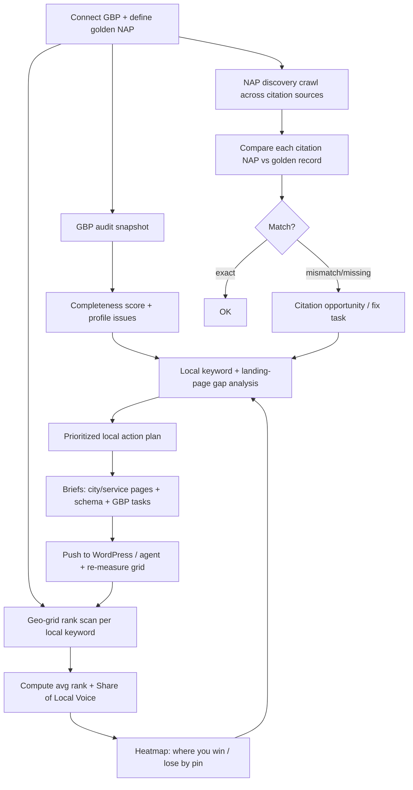

# Phase 7 — Local SEO Engine

> Local visibility is won in the map pack and the local finder, not the classic SERP.
> This engine models Google Business Profile health, NAP consistency, citation gaps,
> geo-grid rankings, and local content gaps — then turns them into prioritized actions.

---

## 7.1 Capabilities

| Capability | What it does |
|---|---|
| **GBP analysis** | Audit completeness/accuracy of the Google Business Profile: categories, attributes, hours, services, photos, posts, Q&A, review velocity & sentiment. |
| **NAP consistency** | Detect Name/Address/Phone discrepancies across the site + citation sources; canonicalize the "golden record". |
| **Citation opportunities** | Find authoritative directories/aggregators where the business is missing or inconsistent. |
| **Local keyword gaps** | "service + city" demand the business should target but doesn't cover. |
| **Local landing pages** | Recommend (and brief) city/service landing pages with internal-link + schema plans. |
| **Geo-grid rank tracking** | Local Falcon–style grid of GBP rankings across a lat/long mesh → share-of-local-voice. |

---

## 7.2 Data model

```sql
CREATE TABLE local_business (
    id            UUID PRIMARY KEY DEFAULT gen_random_uuid(),
    org_id        UUID NOT NULL,
    project_id    UUID NOT NULL,
    name          TEXT NOT NULL,                 -- golden record
    address       JSONB NOT NULL,                -- {street,city,region,postal,country,lat,lng}
    phone         TEXT NOT NULL,
    primary_category TEXT,
    gbp_place_id  TEXT,
    website       TEXT,
    nap_hash      BYTEA,                          -- canonical NAP fingerprint
    created_at    TIMESTAMPTZ DEFAULT now()
);

CREATE TABLE gbp_snapshot (                        -- time-series of profile health
    id            UUID PRIMARY KEY DEFAULT gen_random_uuid(),
    business_id   UUID NOT NULL REFERENCES local_business(id) ON DELETE CASCADE,
    org_id        UUID NOT NULL,
    captured_at   TIMESTAMPTZ NOT NULL DEFAULT now(),
    completeness  NUMERIC(5,2),                    -- 0-100
    categories    JSONB, attributes JSONB, hours JSONB,
    photos_count  INT, posts_30d INT,
    review_count  INT, review_avg NUMERIC(3,2), review_velocity NUMERIC(6,2),
    unanswered_qa INT, unanswered_reviews INT,
    issues        JSONB
);

CREATE TABLE citation (
    id            UUID PRIMARY KEY DEFAULT gen_random_uuid(),
    business_id   UUID NOT NULL REFERENCES local_business(id) ON DELETE CASCADE,
    org_id        UUID NOT NULL,
    source        TEXT NOT NULL,                   -- yelp|bbb|apple_maps|bing|yellowpages|...
    url           TEXT,
    found_name    TEXT, found_address JSONB, found_phone TEXT,
    nap_match     TEXT,                            -- exact|partial|mismatch|missing
    status        TEXT DEFAULT 'open'              -- open|claimed|fixed
);

CREATE TABLE geo_grid_scan (
    id            UUID PRIMARY KEY DEFAULT gen_random_uuid(),
    business_id   UUID NOT NULL REFERENCES local_business(id) ON DELETE CASCADE,
    org_id        UUID NOT NULL,
    keyword       TEXT NOT NULL,
    grid          JSONB NOT NULL,                  -- [{lat,lng,rank}] mesh of pins
    avg_rank      NUMERIC(5,2),
    solv          NUMERIC(5,2),                    -- share of local voice 0-100
    scanned_at    TIMESTAMPTZ NOT NULL DEFAULT now()
);
```

---

## 7.3 Complete workflow



### 7.3.1 NAP consistency algorithm

```python
def nap_audit(business):
    golden = canonical_nap(business)                  # normalized name/addr/phone
    findings = []
    for src in CITATION_SOURCES:                      # yelp, apple, bing, bbb, niche dirs...
        listing = fetch_listing(src, business)
        if not listing:
            findings.append(Citation(src, status='missing'))    # opportunity
            continue
        match = compare_nap(golden, normalize(listing))         # fuzzy + phone canonicalization
        findings.append(Citation(src, nap_match=match.level,
                                  details=match.diffs,
                                  status='open' if match.level != 'exact' else 'ok'))
    consistency_score = 100 * exact_count(findings) / len(findings)
    return findings, consistency_score
```

### 7.3.2 Geo-grid scan + Share of Local Voice

```python
def geo_grid_scan(business, keyword, radius_km=5, n=7):
    grid = build_grid(business.lat, business.lng, radius_km, n)   # n×n pin mesh
    results = []
    for pin in grid:
        local_pack = query_local_results(keyword, pin.lat, pin.lng)  # rank of business
        rank = position_of(business.gbp_place_id, local_pack)
        results.append({'lat': pin.lat, 'lng': pin.lng, 'rank': rank or 0})
    avg_rank = mean([r['rank'] for r in results if r['rank']])
    solv = share_of_local_voice(results)              # weighted: top-3 pins worth more
    return GeoGridScan(keyword, grid=results, avg_rank=avg_rank, solv=solv)
```

### 7.3.3 Local keyword + landing-page gap

```python
def local_gaps(business, site):
    services = business.services                       # from GBP + site
    cities   = serviceable_cities(business)            # service-area or location radius
    matrix = [(svc, city) for svc in services for city in cities]
    gaps = []
    for svc, city in matrix:
        kw = f"{svc} {city}"
        demand = keyword_demand(kw)
        page = best_local_page(site, svc, city)        # semantic + URL match
        if demand > MIN_LOCAL_DEMAND and (page is None or weak(page)):
            gaps.append(LandingPageRec(service=svc, city=city, demand=demand,
                        internal_links=suggest_links(svc, city),   # Phase 9
                        schema=['LocalBusiness','Service','FAQPage'],
                        brief=generate_brief(kw)))      # Phase 11 agent
    return rank_by_priority(gaps)                       # demand * grid_weakness * conversion_value
```

---

## 7.4 Scoring: Local Health Score (0–100)

```
LocalHealth = 0.30 * GBP_completeness
            + 0.25 * NAP_consistency
            + 0.25 * GridVisibility (SoLV across core keywords)
            + 0.20 * ReviewHealth (volume, velocity, rating, response rate)
```

Each subscore drops directly into the unified opportunity backlog (Phase 4 scoring) so local
tasks compete on equal footing with technical and content tasks for the agent's attention.

---

## 7.5 Outputs & integration

- **Dashboard:** GBP health card, NAP discrepancy table, citation gap list, geo-grid heatmap, SoLV trend.
- **Actions:** GBP fix checklist, citation submission/correction tasks, local landing-page briefs (with schema + internal-link plans handed to Phase 9 + Phase 10).
- **Closed loop:** after fixes deploy, re-run geo-grid scans and recompute SoLV to attribute movement — the same measure-the-outcome discipline used everywhere in GOAAISEO.
