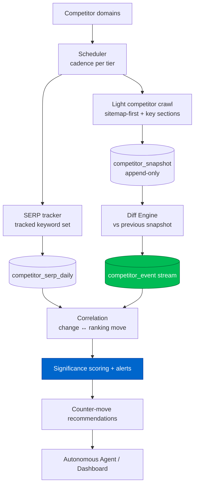
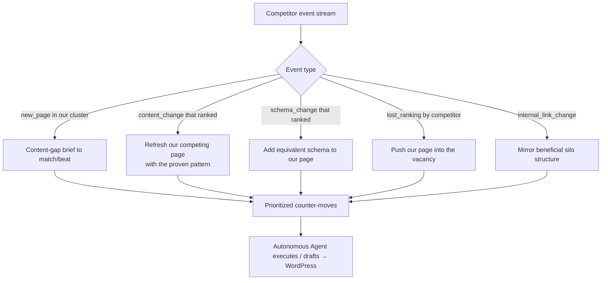

# Phase 8 — Competitor Intelligence Engine

> Continuous change-detection on competitor domains. Input: competitor domains.
> Output: a dated stream of what changed — content edits, new/lost pages, new keywords,
> internal-linking shifts, and schema changes — turned into "respond now" signals.

---

## 8.1 Philosophy

Most tools give a one-time competitor snapshot. The intelligence is in the **derivative**:
*what changed, when, and why it matters*. GOAAISEO reuses the crawl-snapshot pattern (Phase 3)
to diff competitors over time and correlates their moves with their ranking changes (SERP
tracking) to infer *which changes actually worked* — then recommends a counter-move.

---

## 8.2 What we monitor

| Signal | How detected |
|---|---|
| **Content changes** | Diff main-content text + `content_hash`/`simhash` between competitor snapshots. |
| **New pages** | URLs present this run, absent last run (via sitemap + crawl frontier). |
| **Lost pages** | URLs that 404/redirect/drop out vs. prior run. |
| **New keywords** | SERP tracking: queries where a competitor newly appears/rises in top results. |
| **Lost rankings** | Queries where a competitor falls/disappears (your opportunity). |
| **Internal linking changes** | Diff competitor link graph: new hub pages, anchor shifts, silo restructdirection. |
| **Schema changes** | Diff JSON-LD types/properties between snapshots (e.g., added FAQ/Product/Review schema). |
| **Title/meta/H1 changes** | Field-level diff (often signals a deliberate CTR/intent experiment). |

---

## 8.3 Monitoring framework



### Cadence by importance
- **Tier-1 competitors / priority sections:** daily.
- **Tier-2:** weekly.
- **Polite + efficient:** sitemap `lastmod` and conditional GET to crawl only changed URLs; respect robots.txt.

---

## 8.4 Data model

```sql
CREATE TABLE competitor (
    id          UUID PRIMARY KEY DEFAULT gen_random_uuid(),
    org_id      UUID NOT NULL,
    project_id  UUID NOT NULL,
    domain      TEXT NOT NULL,
    tier        INT DEFAULT 2,                 -- monitoring cadence tier
    created_at  TIMESTAMPTZ DEFAULT now()
);

CREATE TABLE competitor_snapshot (              -- reuses crawl-snapshot pattern
    id            UUID PRIMARY KEY DEFAULT gen_random_uuid(),
    competitor_id UUID NOT NULL REFERENCES competitor(id) ON DELETE CASCADE,
    org_id        UUID NOT NULL,
    url           TEXT NOT NULL,
    captured_at   TIMESTAMPTZ NOT NULL DEFAULT now(),
    status_code   INT,
    title TEXT, meta_description TEXT, h1 TEXT,
    word_count    INT,
    content_hash  BYTEA, simhash BIGINT,
    structured_data JSONB,
    outlinks      JSONB,                        -- internal link targets + anchors
    raw_html_key  TEXT
);
CREATE INDEX ON competitor_snapshot (competitor_id, url, captured_at DESC);

CREATE TABLE competitor_event (                 -- the derivative: what changed
    id            UUID PRIMARY KEY DEFAULT gen_random_uuid(),
    org_id        UUID NOT NULL,
    competitor_id UUID NOT NULL,
    url           TEXT,
    event_type    TEXT NOT NULL,    -- new_page|lost_page|content_change|schema_change|
                                    -- title_change|internal_link_change|new_keyword|lost_ranking
    detected_at   TIMESTAMPTZ NOT NULL DEFAULT now(),
    before        JSONB, after JSONB, diff JSONB,
    significance  NUMERIC(6,3),     -- 0-100 (see scoring)
    correlated_rank_change JSONB    -- {keyword, pos_before, pos_after} if linked
);
CREATE INDEX ON competitor_event (org_id, competitor_id, detected_at DESC);
CREATE INDEX ON competitor_event (org_id, event_type, significance DESC);

CREATE TABLE competitor_serp_daily (
    org_id    UUID NOT NULL, project_id UUID NOT NULL,
    date      DATE NOT NULL, keyword TEXT NOT NULL,
    domain    TEXT NOT NULL, url TEXT, position INT, serp_features JSONB,
    PRIMARY KEY (org_id, project_id, date, keyword, domain)
);
```

---

## 8.5 Diff engine

```python
def diff_competitor(competitor):
    prev = latest_snapshot_map(competitor, which='previous')   # url -> snapshot
    cur  = latest_snapshot_map(competitor, which='current')
    events = []

    # New / lost pages
    for url in cur.keys() - prev.keys():
        events.append(Event('new_page', url, after=summary(cur[url])))
    for url in prev.keys() - cur.keys():
        events.append(Event('lost_page', url, before=summary(prev[url])))

    # Field-level + content diffs on persisted pages
    for url in cur.keys() & prev.keys():
        c, p = cur[url], prev[url]
        if c.content_hash != p.content_hash:
            sim = hamming(c.simhash, p.simhash)
            events.append(Event('content_change', url,
                          diff={'similarity': simhash_to_pct(sim),
                                'word_delta': c.word_count - p.word_count}))
        if c.title != p.title:
            events.append(Event('title_change', url, before=p.title, after=c.title))
        if jsonld_types(c) != jsonld_types(p):
            events.append(Event('schema_change', url,
                          diff=set_diff(jsonld_types(p), jsonld_types(c))))
        link_delta = diff_links(p.outlinks, c.outlinks)
        if link_delta.significant():
            events.append(Event('internal_link_change', url, diff=link_delta))

    for e in events:
        e.significance = score_significance(e, competitor)     # see 8.6
    return events
```

### New / lost keyword detection (from SERP tracker)

```python
def keyword_movements(project, window=7):
    cur  = serp_rows(project, window)
    prev = serp_rows(project, window, offset=window)
    for (kw, domain), c in cur.items():
        p = prev.get((kw, domain))
        if p is None and c.position <= 20:
            emit('new_keyword', domain, kw, after=c.position)
        elif p and (c.position - p.position) <= -3:
            emit('competitor_rising', domain, kw, before=p.position, after=c.position)
        elif p and (p.position <= 10) and (kw not in cur):
            emit('lost_ranking', domain, kw, before=p.position)   # your opportunity
```

---

## 8.6 Significance scoring & correlation

```
significance(event) = 100 * normalize(
        page_value          # competitor page's estimated traffic/keyword count
      * change_magnitude    # word delta %, schema additions, link-graph centrality shift
      * topical_relevance   # cosine(event.page, our priority clusters) — Phase 5
      * recency_weight )
```

**Causal correlation:** when a `content_change`/`schema_change` on a competitor URL is followed
(within an attribution window) by a ranking gain on associated keywords, we tag the event
`correlated_rank_change` and raise its significance — turning observations into *playbook
evidence* ("competitor added FAQ schema + answer-first intro → moved 6→2 for X").

---

## 8.7 Outputs → action



Every competitor event becomes a scored item in the unified opportunity backlog (Phase 4),
competing with internal opportunities for the agent's attention. The correlation dataset
("which competitor moves preceded ranking gains") compounds into GOAAISEO's outcome moat.
