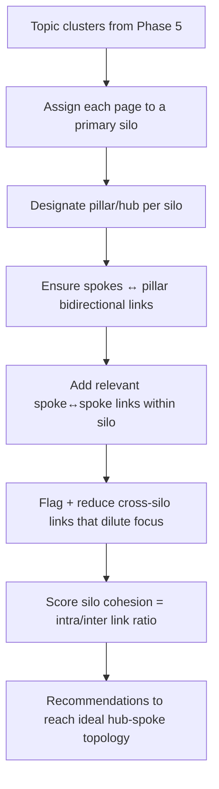

# Phase 9 — Internal Linking AI

> Internal links are the most controllable ranking lever — you own every one. This engine
> analyzes the full site graph + topic model + GSC performance to recommend the highest-impact
> links, optimal anchors, link-equity redistribution, and clean silo structures.

---

## 9.1 What it produces

| Output | Definition |
|---|---|
| **Best linking opportunities** | Specific source→target link suggestions ranked by expected impact. |
| **Anchor suggestions** | Natural, varied, semantically relevant anchor text per suggested link. |
| **Link-equity improvements** | Moves that redistribute internal PageRank toward priority/under-linked pages. |
| **Silo recommendations** | Hub-and-spoke topical clusters with clean cross-links and minimal cross-silo bleed. |

---

## 9.2 Inputs (all already computed in earlier phases)

- **Site graph** — pages, links, anchors, positions, internal PageRank (Phase 3).
- **Topic model** — clusters, pillars, page embeddings, coverage (Phase 5).
- **GSC performance** — clicks, impressions, position per page (Phase 4).
- **Crawl content** — candidate anchor contexts (relevant sentences) per page.

---

## 9.3 Core algorithm

```python
def internal_link_recommendations(site, top_k=200):
    G        = load_link_graph(site)            # directed graph, internal only
    pr       = pagerank(G)                       # current equity distribution
    clusters = load_topic_clusters(site)         # Phase 5
    perf     = load_gsc_perf(site)               # Phase 4

    # 1. Identify TARGETS that deserve more equity
    targets = []
    for p in site.pages:
        priority = target_priority(p, perf, clusters)   # high demand + striking-distance + low inlinks
        if priority > THRESH:
            targets.append((p, priority))

    recs = []
    for target, priority in targets:
        # 2. Find SOURCE pages: semantically relevant, higher authority, not already linking
        candidates = semantic_neighbors(target, clusters, k=50)         # cosine on embeddings
        candidates = [s for s in candidates
                      if s.id != target.id
                      and not edge_exists(G, s, target)
                      and same_or_adjacent_cluster(s, target)]          # respect silo
        for src in candidates:
            score = link_value(src, target, pr, priority, clusters)     # see 9.4
            anchor, context = suggest_anchor(src, target)               # see 9.5
            recs.append(LinkRec(src=src.url, target=target.url, score=score,
                                anchor=anchor, context_snippet=context,
                                rationale=explain(src, target, pr, priority)))
    return top(recs, top_k, dedup_per_source_cap=ANCHOR_DIVERSITY_CAP)
```

### 9.4 Link-value scoring

```
link_value(src, target) =
      w1 * src_authority        # PageRank(src): higher-equity sources pass more value
    + w2 * relevance            # cosine(src.embedding, target.embedding)
    + w3 * target_need          # 1 / (1 + target.internal_inlinks)  — boost under-linked pages
    + w4 * demand_fit           # target striking-distance / impression weight (GSC)
    + w5 * proximity            # shorter resulting click-depth to target = better
    - p1 * cannibalization_risk # penalize linking competing pages with the SAME anchor/intent
    - p2 * silo_violation       # penalize cross-silo links that dilute topical focus
```

Weights are tunable and learned from the closed loop: links whose deployment preceded ranking
gains for the target up-weight their feature pattern over time (Phase 11).

### 9.5 Anchor suggestion

```python
def suggest_anchor(src, target):
    # Mine the source page for a sentence semantically close to the target's topic
    sentences = split_sentences(src.main_content)
    best = argmax(sentences, key=lambda s: cosine(embed(s), target.embedding))
    # Extract a natural noun-phrase anchor; vary phrasing to avoid over-optimization
    candidates = extract_noun_phrases(best) + target_keyword_variants(target)
    anchor = choose_anchor(candidates,
                avoid_exact_match_overuse=True,        # diversify across the site
                relevant_to=target.primary_query)
    return anchor, surrounding_context(best)           # gives the editor/agent insertion point
```

---

## 9.4b Link-equity redistribution

```python
def equity_recommendations(site):
    G  = load_link_graph(site)
    pr = pagerank(G)
    priority_pages = high_value_underranked(site)       # GSC striking-distance + business value
    leaks = []
    # Find equity "sinks": high-PR pages linking heavily to low-value/utility pages
    for u in G.nodes:
        if pr[u] > HIGH and outlink_value_ratio(u, G) < LOW:
            leaks.append(u)
    moves = []
    for sink in leaks:
        for pp in priority_pages:
            if relevant(sink, pp) and not edge_exists(G, sink, pp):
                delta = simulate_pagerank_delta(G, add_edge=(sink, pp))   # what-if recompute
                moves.append(EquityMove(sink, pp, expected_pr_gain=delta))
    return rank(moves, by='expected_pr_gain')
```

The what-if simulation runs PageRank on a copy of the graph with the proposed edge(s) added,
so each recommendation carries a concrete **expected equity gain** — explainable, not hand-wavy.

---

## 9.6 Silo recommendation



```python
def silo_plan(site):
    clusters = load_topic_clusters(site)
    plan = []
    for c in clusters:
        pillar = c.pillar_page or pick_pillar(c)         # highest authority+coverage
        for spoke in c.pages:
            if spoke == pillar: continue
            if not linked(spoke, pillar): plan.append(Link(spoke, pillar, 'up'))
            if not linked(pillar, spoke): plan.append(Link(pillar, spoke, 'down'))
        # sibling links: top-N most semantically related spokes
        for a, b in top_related_pairs(c.pages):
            if not linked(a, b): plan.append(Link(a, b, 'sibling'))
        # cross-silo hygiene
        for x in cross_silo_links(c): plan.append(Flag(x, 'review_cross_silo'))
    return plan
```

---

## 9.7 Outputs & integration

- **Per-page panel:** "Add these N inbound links" + "Best outbound targets" with anchors and one-click insert positions.
- **Site-wide:** silo map visualization, orphan-rescue links (pages with 0 inlinks from Phase 3), equity-leak fixes.
- **Action:** recommendations export to the WordPress plugin (Phase 10) where the agent can insert links at the suggested context, or the editor approves them.
- **Closed loop:** after links deploy, track the target pages' GSC position/clicks vs. control pages to attribute lift — feeding the learned weights in 9.4.

This engine reads entirely off data already in the Ground-Truth Graph, making internal linking
a continuous, measurable, automated lever rather than a periodic manual audit.
