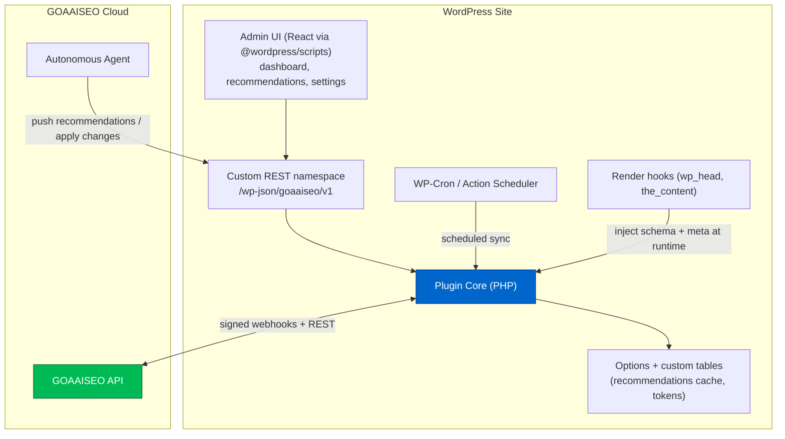

# Phase 10 — WordPress Integration

> The action surface. WordPress powers a huge share of the sites GOAAISEO serves, so the plugin
> turns recommendations into one-click (or autonomous) changes: crawl triggers, schema injection,
> internal-link insertion, content optimization, and Search Console sync — without leaving WP.

---

## 10.1 Why a plugin (not just an API)

- **Write-back is the moat (Phase 1).** Reading WP via REST is easy; *safely applying* schema,
  links, and meta changes inside the editor/runtime needs a plugin.
- **Zero-friction onboarding.** OAuth-style pairing connects a site in minutes; the plugin
  auto-discovers post types, taxonomies, and the active SEO plugin (Yoast/RankMath) to avoid conflicts.
- **Runtime injection.** Schema/meta can be output at render time (always correct) instead of
  baked into post content (drifts).

---

## 10.2 Plugin architecture



### Trust & safety
- **Auth:** site issues a scoped application password / signed key during pairing; all cloud↔plugin calls are HMAC-signed and replay-protected (nonce + timestamp).
- **Reversibility:** every applied change is recorded with a `change_id` and a *revert payload*; one-click undo.
- **Modes:** `suggest` (human approves), `auto-safe` (agent applies low-risk changes like schema/meta), `auto-full` (agent applies content/link changes) — per-site policy.
- **Conflict-aware:** detects Yoast/RankMath and defers or augments rather than duplicating meta/schema.

---

## 10.3 Capabilities

| Capability | Mechanism |
|---|---|
| **One-click crawl** | Admin button → calls cloud `POST /sites/:id/crawls`; status polled via REST; results surfaced in WP. |
| **Schema generation** | Cloud generates JSON-LD (Article/FAQ/HowTo/Product/LocalBusiness/Author/Org); plugin injects via `wp_head` at runtime; validated before publish. |
| **Internal-link recommendations** | Phase 9 recs rendered in a post sidebar panel; approve → plugin inserts `<a>` at the suggested context, or agent applies in auto mode. |
| **Content optimization** | Inline editor assistant: GSC-grounded brief, missing entities/subtopics, extractability (GEO) fixes, suggested headings/FAQ blocks. |
| **Search Console sync** | Plugin surfaces per-URL GSC metrics + opportunities inside the post editor (the data the GSC UI hides), pulled from cloud. |

---

## 10.4 Plugin file structure

```
goaaiseo-wp/
├── goaaiseo.php                      # Plugin bootstrap, header, activation/deactivation hooks
├── composer.json                     # PSR-4 autoload, PHP deps
├── package.json                      # JS build (@wordpress/scripts) for admin UI
├── uninstall.php
├── includes/
│   ├── class-plugin.php              # Singleton bootstrap, DI container
│   ├── class-activator.php           # creates custom tables, schedules cron
│   ├── class-deactivator.php
│   ├── Auth/
│   │   ├── class-pairing.php         # site<->cloud pairing, key exchange
│   │   └── class-hmac-signer.php     # request signing / verification
│   ├── Rest/
│   │   ├── class-rest-controller.php # registers /goaaiseo/v1 routes
│   │   ├── class-recommendations-endpoint.php
│   │   ├── class-changes-endpoint.php
│   │   └── class-sync-endpoint.php
│   ├── Sync/
│   │   ├── class-gsc-sync.php        # pull per-URL GSC metrics from cloud
│   │   └── class-crawl-trigger.php
│   ├── Schema/
│   │   ├── class-schema-builder.php  # build JSON-LD per post type/intent
│   │   ├── class-schema-injector.php # wp_head runtime injection
│   │   └── class-conflict-detector.php  # Yoast/RankMath awareness
│   ├── Content/
│   │   ├── class-internal-linker.php # insert/revert internal links safely
│   │   └── class-content-optimizer.php
│   ├── Changes/
│   │   ├── class-change-log.php      # record applied changes + revert payloads
│   │   └── class-revert.php
│   └── Cron/
│       └── class-scheduler.php       # Action Scheduler jobs (sync, apply queue)
├── admin/
│   ├── src/                          # React admin app
│   │   ├── index.js
│   │   ├── pages/{Dashboard,Recommendations,Settings}.jsx
│   │   ├── editor/SidebarPanel.jsx   # Gutenberg plugin sidebar
│   │   └── api/client.js
│   └── build/                        # compiled assets
├── blocks/
│   └── faq-block/                    # optional Gutenberg blocks (FAQ, key-takeaways)
└── languages/
```

---

## 10.5 REST endpoints (`/wp-json/goaaiseo/v1`)

```
# Pairing & health
POST   /pair                      # exchange pairing code → store signed key
GET    /health                    # plugin version, WP version, SEO-plugin detected

# Crawl
POST   /crawl                     # trigger cloud crawl for this site
GET    /crawl/status              # latest crawl status + summary

# Recommendations (pulled from cloud, cached locally)
GET    /recommendations?post_id=  # all recs for a post (links, schema, content, GEO)
POST   /recommendations/refresh   # force re-pull from cloud

# Apply / revert changes (the write-back surface)
POST   /changes/apply             # {type, post_id, payload}  -> applies + logs change_id
POST   /changes/revert            # {change_id}               -> restores revert payload
GET    /changes                   # change history for audit

# Schema
GET    /schema?post_id=           # preview generated JSON-LD
POST   /schema/enable             # toggle runtime injection per post/type

# Search Console sync
GET    /gsc?post_id=              # per-URL metrics + opportunities (proxied from cloud)
POST   /webhook                   # cloud → plugin push (HMAC-verified): new recs / agent actions
```

### Apply-change contract (cloud → plugin)

```jsonc
// POST /changes/apply
{
  "type": "internal_link",          // internal_link | schema | meta | content_block
  "post_id": 1234,
  "change_id": "uuid",              // generated by cloud, tracked for attribution (Phase 11)
  "mode": "auto-safe",
  "payload": {
    "anchor": "local SEO audit",
    "target_url": "https://site.com/local-seo-audit/",
    "context_match": "…run a thorough <<INSERT>> before…"  // where to insert
  },
  "revert": { "snapshot": "…original block HTML…" }
}
```

---

## 10.6 End-to-end flow (recommendation → applied → measured)

```mermaid
sequenceDiagram
    participant Cloud as GOAAISEO Cloud
    participant Agent as Autonomous Agent
    participant WP as WP Plugin
    participant GSC as Search Console
    Agent->>Cloud: generate rec (schema/link/content) with change_id
    Cloud->>WP: webhook push recommendation
    alt suggest mode
        WP->>WP: show in editor; human approves
    else auto mode
        WP->>WP: agent applies via /changes/apply
    end
    WP->>WP: inject/insert + log change + revert payload
    WP-->>Cloud: ack {change_id, applied_at}
    Note over Cloud,GSC: attribution window passes
    Cloud->>GSC: read per-URL metrics pre/post
    Cloud->>Cloud: attribute lift to change_id (Phase 11 loop)
```

This makes WordPress not just a CMS connector but the **execution layer** that closes the loop:
every change carries an ID, is reversible, and is measured against GSC ground truth — turning
recommendations into attributable outcomes and feeding the agent's learned weights.
