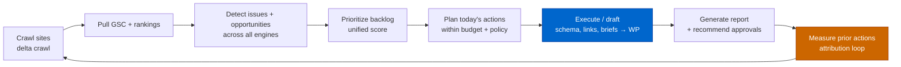
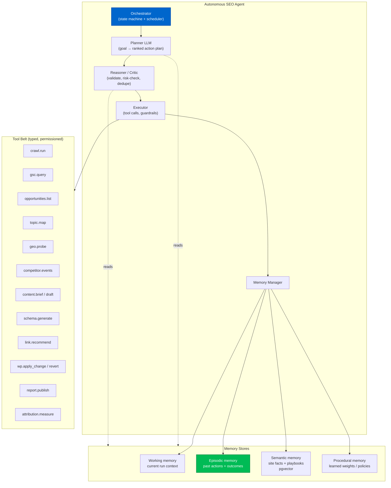

# Phase 11 — Autonomous SEO Agent

> The brain that ties everything together. A daily, tool-using AI agent that senses (crawl +
> GSC + rankings), reasons (opportunities + priorities), acts (briefs, schema, links via WP),
> and learns (closed-loop attribution). This is where GOAAISEO stops being a dashboard and
> becomes an operator.

---

## 11.1 What the agent does, daily



| Daily task | Source phase |
|---|---|
| Crawl websites (delta) | Phase 3 |
| Analyze rankings & GSC | Phase 4 |
| Detect issues (technical, content, local, GEO, competitor) | Phases 3–8 |
| Generate reports | this phase |
| Recommend / execute actions | Phases 6, 9, 10 |

---

## 11.2 Agent architecture



### Loop type
A **plan → act → observe → reflect** loop (ReAct-style) with a separate **Critic** pass before
any write action, and a hard **policy/guardrail layer** (budgets, mode, allowed tools, blast-radius caps).

---

## 11.3 Prompt architecture

Layered prompts keep the agent grounded, safe, and cheap.

```
┌─ System prompt (static) ─────────────────────────────────────────────┐
│ Role: senior technical+content SEO operator for {site archetype}.     │
│ Objectives, constraints, safety rules, tool contract, output schema.  │
└───────────────────────────────────────────────────────────────────────┘
┌─ Memory injection (dynamic, retrieved) ──────────────────────────────┐
│ • Site facts (semantic memory): CMS, niche, priority clusters, brand. │
│ • Playbook for this archetype (procedural memory).                    │
│ • Recent actions + measured outcomes (episodic memory, last N).       │
│ • Learned weights: action types that worked on similar sites.         │
└───────────────────────────────────────────────────────────────────────┘
┌─ Task context (dynamic) ─────────────────────────────────────────────┐
│ Today's prioritized opportunity backlog (scored), budget, mode.       │
└───────────────────────────────────────────────────────────────────────┘
┌─ Tool results (loop) ────────────────────────────────────────────────┐
│ Observations from each tool call, fed back for the next decision.     │
└───────────────────────────────────────────────────────────────────────┘
```

### Specialized sub-prompts (delegated tasks)
- **Planner prompt:** "Given backlog + budget + policy, output an ordered action plan with expected lift, effort, and risk per item. Refuse actions outside policy."
- **Critic prompt:** "Review this plan/draft for correctness, over-optimization, brand voice, cannibalization risk, and policy compliance. Approve, revise, or reject with reasons."
- **Brief/draft prompt:** "Using GSC-proven queries + missing entities + competitor-cited patterns, produce an outline/draft optimized for extractability and E-E-A-T. Cite sources; no fabrication."
- **Schema prompt:** "Emit valid JSON-LD of types {…} for this page; validate against schema.org; no invented data."

Every generation prompt enforces **grounding** (use provided GSC/crawl/entity data, never invent
metrics) and **explainability** (state why each action, expected lift).

---

## 11.4 Memory architecture

| Memory | Store | Contents | Used for |
|---|---|---|---|
| **Working** | Redis (ephemeral, per-run) | current backlog, tool outputs, scratchpad | the active reasoning loop |
| **Episodic** | Postgres `agent_action` + `attribution` | every action, change_id, pre/post metrics, outcome | learning what works, avoiding repeats |
| **Semantic** | Postgres + pgvector | durable site facts, brand voice, priority clusters, entity map | grounding + retrieval into prompts |
| **Procedural** | Postgres `agent_policy` / weights | learned action-weights, archetype playbooks, guardrails | better planning over time |

```sql
CREATE TABLE agent_run (
    id          UUID PRIMARY KEY DEFAULT gen_random_uuid(),
    org_id      UUID NOT NULL, site_id UUID NOT NULL,
    started_at  TIMESTAMPTZ DEFAULT now(), finished_at TIMESTAMPTZ,
    mode        TEXT, budget JSONB, plan JSONB, status TEXT
);

CREATE TABLE agent_action (
    id            UUID PRIMARY KEY DEFAULT gen_random_uuid(),
    org_id        UUID NOT NULL, site_id UUID NOT NULL,
    agent_run_id  UUID REFERENCES agent_run(id),
    change_id     UUID,                       -- ties to WP applied change (Phase 10)
    action_type   TEXT NOT NULL,              -- schema|internal_link|content|meta|brief|technical_fix
    target_url    TEXT,
    rationale     TEXT,
    expected_lift JSONB,
    applied_at    TIMESTAMPTZ,
    status        TEXT DEFAULT 'proposed'     -- proposed|approved|applied|reverted
);

CREATE TABLE attribution (
    id            UUID PRIMARY KEY DEFAULT gen_random_uuid(),
    org_id        UUID NOT NULL,
    action_id     UUID REFERENCES agent_action(id),
    metric        TEXT,                        -- clicks|impressions|position|citations|solv
    window_days   INT,
    value_before  NUMERIC, value_after NUMERIC,
    control_delta NUMERIC,                     -- baseline movement on control pages
    net_lift      NUMERIC,                     -- value_after - value_before - control_delta
    confidence    NUMERIC,                     -- significance given volume + window
    measured_at   TIMESTAMPTZ DEFAULT now()
);
```

---

## 11.5 Closed-loop attribution (the learning engine)

```python
def measure_action(action, window=28):
    target = action.target_url
    before = gsc_metrics(target, period=(action.applied_at - window, action.applied_at))
    after  = gsc_metrics(target, period=(action.applied_at, action.applied_at + window))
    # Control: comparable pages NOT changed, to subtract market/seasonality movement
    controls = match_control_pages(target, n=10)
    control_delta = mean(delta(c, window) for c in controls)
    net = (after.clicks - before.clicks) - control_delta
    conf = significance(before.impressions, window)
    persist_attribution(action, net_lift=net, confidence=conf)
    # Update procedural memory: nudge weight for this action_type on this archetype
    if conf > CONF_MIN:
        update_action_weight(action.action_type, site_archetype(action), signal=sign(net))
```

This is GOAAISEO's compounding advantage: a growing, privacy-safe dataset of *which actions
produce lift for which site archetypes*, used to re-rank the backlog (Phase 4 scoring) and bias
the planner — something no read-only competitor can build.

---

## 11.6 Guardrails & autonomy policy

| Guardrail | Rule |
|---|---|
| **Mode gate** | `suggest` / `auto-safe` (schema, meta, orphan-rescue links) / `auto-full` (content, link edits). |
| **Blast radius** | Max N changes/site/day; max % of pages touched per run; rate-limited writes. |
| **Critic approval** | No write action ships without passing the Critic pass + policy check. |
| **Reversibility** | Every change has a revert payload (Phase 10); auto-revert if net_lift strongly negative. |
| **No fabrication** | Generation grounded in stored data; facts/figures must trace to a source. |
| **Human-in-the-loop** | High-risk actions (mass content changes, migrations) always require approval. |
| **Cost ceiling** | Per-org LLM + crawl budget; planner respects remaining budget when scheduling. |

---

## 11.7 Daily report (agent output)

The agent publishes a concise, explainable digest:
- **What changed since yesterday** (rankings up/down, new issues, competitor moves).
- **What I did** (actions applied in auto mode, with change_ids + expected lift).
- **What needs your approval** (suggest-mode items, ranked by ROI).
- **What's working** (attributed lift from prior actions; what I'm doubling down on).
- **Risks/alerts** (decay, indexation drops, NAP breaks, lost rankings).

Delivered in-app, via email/Slack, and through the WordPress admin (Phase 10) — making
GOAAISEO a continuous SEO operator rather than a tool someone remembers to open.
