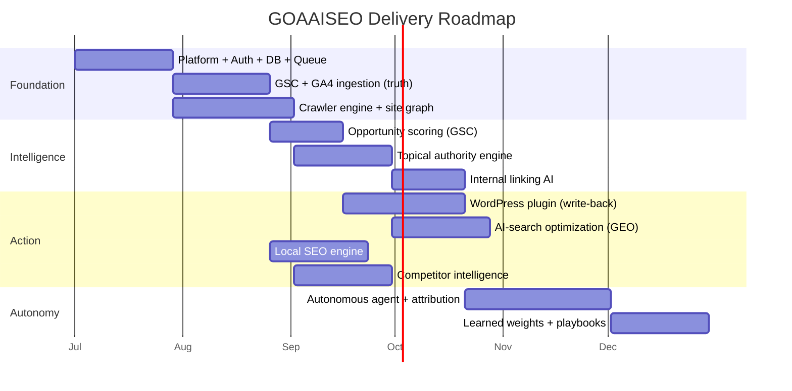
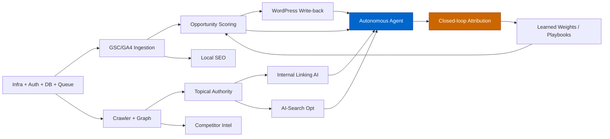

# Phase 13 — Implementation Roadmap

> A dependency-ordered, phase-wise delivery plan. Each phase is shippable, builds on the prior,
> and is sequenced so the moat (ground truth + action loop) comes online as early as possible.
> Effort is in engineer-weeks (EW) assuming a small senior team (2 FE, 2 BE/Python, 1 ML, 0.5 DevOps).

---

## 13.1 Sequencing principle

Build **truth → structure → intelligence → action → autonomy**. Ground truth (GSC) and the
crawler must exist before scoring; scoring before action; action before autonomy. AI-search and
local are parallelizable verticals once the core graph exists.

---

## 13.2 Phase-by-phase plan

### Phase 1 — Foundation (MVP truth + structure)
**Goal:** A user connects GSC + a site, gets a crawl, and sees real GSC data the UI hides.

| Workstream | Effort | Complexity | Dependencies | Priority |
|---|---|---|---|---|
| Monorepo, CI/CD, Docker, infra | 3 EW | Med | — | P0 |
| Auth (Supabase + Google OAuth), multi-tenant RLS | 2 EW | Med | infra | P0 |
| DB schema + migrations (core + crawl + GSC) | 2 EW | Med | infra | P0 |
| Queue (Redis/BullMQ + Python workers) | 2 EW | Med | infra | P0 |
| **GSC + GA4 ingestion** (API + Bulk Export) | 4 EW | High | auth, db | P0 |
| **Crawler engine** + site graph + technical audit | 5 EW | High | queue, db | P0 |
| Web shell: dashboard, crawl results, GSC explorer | 4 EW | Med | api | P0 |

**Exit criteria:** real GSC query×page joins visible; full crawl with issues; site graph stored.
**~22 EW.**

### Phase 2 — Intelligence (scoring + topical authority)
**Goal:** Turn raw truth + graph into a prioritized, explainable opportunity backlog.

| Workstream | Effort | Complexity | Dependencies | Priority |
|---|---|---|---|---|
| Opportunity scoring (CTR/striking/decay/cannibalization/SERP-feature) | 3 EW | High | GSC ingestion | P0 |
| Unified priority score + backlog UI | 2 EW | Med | scoring | P0 |
| Embeddings + clustering (topical map) | 4 EW | High | crawler, ML | P1 |
| Entity extraction + KG linking | 2 EW | High | nlp | P1 |
| Internal linking AI + silo plan | 3 EW | Med | topic map, graph | P1 |

**Exit criteria:** prioritized opportunities with "why + expected lift"; topical map + gaps; link recs.
**~14 EW.**

### Phase 3 — Action (write-back + verticals)
**Goal:** Ship changes and cover AI-search, local, and competitor verticals.

| Workstream | Effort | Complexity | Dependencies | Priority |
|---|---|---|---|---|
| **WordPress plugin** (crawl, schema, links, GSC sync, change-log/revert) | 5 EW | High | api, scoring | P0 |
| AI-search optimization (prompt-space, probing, GEO score) | 4 EW | High | topic map, entities | P1 |
| Local SEO engine (GBP, NAP, geo-grid, citations) | 4 EW | Med | connectors | P1 |
| Competitor intelligence (snapshots, diff, events, SERP) | 4 EW | Med | crawler | P2 |

**Exit criteria:** recommendations applied + reverted via WP; GEO scores + citation tracking live;
local health + grid; competitor change stream.
**~17 EW.**

### Phase 4 — Autonomy (the moat completes)
**Goal:** The daily agent operates the loop and learns.

| Workstream | Effort | Complexity | Dependencies | Priority |
|---|---|---|---|---|
| Agent orchestrator + planner + critic + tools | 6 EW | Very High | all engines, WP | P0 |
| Memory stores (working/episodic/semantic/procedural) | 2 EW | High | db, pgvector | P0 |
| **Closed-loop attribution** (control pages, net lift) | 3 EW | High | GSC, agent actions | P0 |
| Learned weights + archetype playbooks | 4 EW | Very High | attribution data | P1 |
| Reporting + alerting (in-app, email/Slack, WP) | 2 EW | Med | agent | P1 |

**Exit criteria:** agent runs daily within guardrails, applies safe changes, attributes lift,
and re-ranks the backlog from what works.
**~17 EW.**

---

## 13.3 Dependency graph

---

## 13.4 Risk register & mitigations

| Risk | Impact | Mitigation |
|---|---|---|
| GSC API quotas / Bulk Export setup friction | High | Backoff + token buckets; guided Bulk Export onboarding; cache aggressively. |
| Crawler scale / politeness / JS rendering cost | High | Conditional GET, render-on-demand, per-plan budgets, autoscaled worker pools. |
| AI-search probing instability / ToS | Med | Use official APIs where available; rate-limit; treat non-determinism with sampling; legal review. |
| LLM cost blow-up | Med | Cache embeddings by content hash; per-org budgets; smaller models for routine tasks. |
| Write-back breaking customer sites | High | Reversible changes, Critic gate, blast-radius caps, auto-revert on negative lift. |
| Attribution confounding (seasonality) | Med | Control-page baselines; confidence thresholds; sufficient impression volume gates. |
| Multi-tenant data leakage | Critical | Postgres RLS on every table; tenant tests in CI; least-privilege service roles. |

---

## 13.5 MVP cut-line (fastest path to value)

If shipping a lean MVP first, the minimum lovable product is:
**Phase 1 (truth + crawl) + GSC opportunity scoring + WordPress write-back for schema & internal links.**

That alone beats incumbents on the one axis none of them own: *seeing your real hidden GSC data
and acting on it inside your CMS.* Everything else (topical authority, GEO, local, competitor,
autonomy) layers on to deepen the moat.

---

## 13.6 Total effort summary

| Phase | Focus | Effort | Cumulative |
|---|---|---|---|
| 1 | Foundation (truth + structure) | ~22 EW | 22 |
| 2 | Intelligence (scoring + topics) | ~14 EW | 36 |
| 3 | Action (write-back + verticals) | ~17 EW | 53 |
| 4 | Autonomy (agent + attribution) | ~17 EW | 70 |

~**70 engineer-weeks** to a complete, differentiated v1 with the full closed loop — roughly
**7–9 calendar months** for the assumed team, with verticals (local, competitor, GEO)
parallelizable to compress the timeline.
