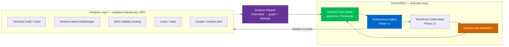

# Phase 14 — Analysis-Layer Adoption (Buy vs. Build)

> A strategic revision, not a new feature. The SEO *analysis* surface (technical audit, schema,
> GEO scoring, content quality) has commoditized into a mature open-source engine —
> [`claude-seo`](https://github.com/AgriciDaniel/claude-seo) (MIT). This phase adopts it as
> GOAAISEO's analysis layer so the build concentrates on the one thing no external tool provides:
> the **closed loop** — persistent ground-truth graph, longitudinal measurement, autonomous
> write-back, and attribution. Borrow the commodity; build only the moat.

---

## 14.1 The thesis

The original blueprint (Phases 3–9) planned to build the entire analysis stack in-house. That was
correct when written; it is no longer the highest-leverage path. A production-grade, primary-source-current
analysis engine now exists under a permissive licence:

- `claude-seo` — 25 sub-skills, 18 specialist agents, 32 commands, ~410 tests, active maintenance,
  MIT. Covers technical SEO, E‑E‑A‑T, Schema.org, GEO/AI-search, local + maps, e-commerce, hreflang,
  Google APIs (GSC/PSI/CrUX/GA4/Ads), backlinks, drift snapshots, clustering, and PDF reporting.

**The distinction that matters:** `claude-seo` is an *advisor* — it perceives, analyzes, and
recommends, statelessly, per run. GOAAISEO is an *operator* — it also **persists, acts, and measures
over time**. Those are different categories. Adopting the advisor does not erode the moat; it frees
the team to build the moat faster.

> **Design decision:** adopt `claude-seo` as the analysis provider; do **not** fork it, and do **not**
> rebuild Phases 3–9 from scratch. Rebuild only where GOAAISEO is differentiated (14.3).

---

## 14.2 Overlap map — what to adopt, augment, or build

Each row is a verdict against the existing phase docs.

| Phase | Capability | `claude-seo` coverage | Verdict |
|---|---|---|---|
| 3 | Render-aware crawl, technical audit | ✅ Playwright + trafilatura, ~500 pp, 9 categories | **Adopt** for audit; **build** the persistent site-graph store |
| 4 | GSC/GA4 ingestion | ⚠️ Point-in-time reads (Tier 1/2 APIs) | **Build** — de-aggregated, forever-stored time-series is the moat (14.3) |
| 5 | Topical authority, clustering | ✅ `seo-cluster` (SERP-overlap), content briefs | **Adopt** clustering + briefs; **build** graph persistence + gap tracking over time |
| 6 | AI-search / GEO scoring | ✅ Passage citability, evidence-based reframes | **Adopt** the scorer; **build** the multi-engine *citation index* over time |
| 7 | Local SEO | ✅ GBP, NAP, geo-grid, local schema | **Adopt** wholesale |
| 8 | Competitor intelligence | ⚠️ Backlinks + DataForSEO + drift snapshots | **Augment** — adopt data pulls; **build** longitudinal change-event graph + causal correlation |
| 9 | Internal linking | ⚠️ Cluster link matrices | **Augment** — adopt suggestions; **build** PageRank/equity model on the persisted graph |
| 10 | WordPress write-back | ❌ Recommends only | **Build** — this is the action moat |
| 11 | Autonomous agent + attribution | ❌ No loop, no memory | **Build** — this is the autonomy moat |

**Rule of thumb:** anything *stateless and point-in-time* → adopt. Anything that requires
*persistence, longitudinal history, action, or measurement* → build.

---

## 14.3 What GOAAISEO still builds (the non-negotiable moat)

These are absent from `claude-seo` by design and remain 100% in-scope:

1. **The Ground-Truth Graph** — per-tenant, persistent nodes/edges/time-series (see BLUEPRINT.md).
   `claude-seo` produces findings; GOAAISEO *remembers* them and watches them move.
2. **De-aggregated GSC forever** — Timescale history beyond Google's 16-month window; the spine of
   attribution. `claude-seo` reads GSC live but does not warehouse it.
3. **Autonomous, reversible WordPress write-back** (Phase 10) — the action surface.
4. **Closed-loop attribution** (Phase 11) — control pages, `net_lift`, learned weights. The
   compounding *outcome causality index*.
5. **AI-search citation index over time** (Phase 6) — multi-engine probing warehoused as a
   longitudinal asset, not a single scan.
6. **Multi-tenant platform** — RLS, budgets, guardrails, agency workflows.

`claude-seo` fills the left of the loop (perceive → analyze); GOAAISEO owns the right (act → measure
→ learn) and the memory that connects them.

---

## 14.4 Where the analysis layer plugs in



The adapter is the seam: `claude-seo` emits Markdown/JSON findings; the adapter normalizes them into
graph writes (nodes, edges, issues with evidence) and into `agent_action` candidates the planner can
schedule.

---

## 14.5 Integration seam — three options, ranked

`claude-seo` is bound to the Claude Code runtime, while GOAAISEO's services are NestJS + Python/FastAPI.
That coupling is the *only* real friction; here are the ways across it, cheapest first.

| # | Approach | How | Trade-off |
|---|---|---|---|
| **A** | **Call the Python scripts directly** | Most sub-skills wrap plain Python (`scripts/render_page.py`, fetch, scoring). Import/subprocess them from a FastAPI `analysis` service; skip the Claude Code shell. | Lowest coupling, most control; you re-wrap the orchestration, not the logic. **Recommended for the platform.** |
| **B** | **Agent-orchestrated tool** | Phase 11 agent (in a Claude Code-compatible host) runs `/seo …` commands as tools; adapter ingests the output files. | Fastest to a working demo; ties that path to the Claude Code runtime. |
| **C** | **Reference implementation** | Treat `claude-seo` as a spec/source and port the pieces you need into your services. | Highest effort; use only where A/B can't reach (deep platform coupling). |

### Adapter contract (normalization target)

```python
# analysis-adapter: claude-seo output -> Ground-Truth Graph + action candidates
def ingest_seo_report(report: dict, site_id: UUID) -> IngestResult:
    """Map a claude-seo audit/schema/geo/local report into GOAAISEO's model."""
    upsert_page_nodes(report.pages, site_id)            # Phase 3 graph
    for finding in report.findings:
        record_issue(                                   # evidence-carrying issue
            site_id, url=finding.url, category=finding.category,
            severity=finding.severity, evidence=finding.observation,
            falsifiability=finding.how_would_we_know_it_failed,   # native to claude-seo
        )
        if finding.actionable:
            propose_agent_action(                       # Phase 11 backlog candidate
                site_id, action_type=map_type(finding), target_url=finding.url,
                rationale=finding.observation, expected_lift=estimate(finding),
                source="claude-seo",
            )
    persist_geo_scores(report.geo, site_id)             # feeds Phase 6 citation index
    return IngestResult(nodes=..., issues=..., candidates=...)
```

Two properties make this clean: `claude-seo` findings already carry a **falsifiability check + leading
indicator**, which map directly onto GOAAISEO's "everything explainable" tenet and the attribution
loop's leading-indicator monitoring.

---

## 14.6 Tool-belt mapping (Phase 11)

The agent's typed tool belt (Phase 11.2) is re-expressed so several tools *delegate* to the analysis
layer instead of bespoke code:

| Phase 11 tool | Now backed by |
|---|---|
| `crawl.run` | `claude-seo` audit crawl (Option A) → adapter → graph |
| `topic.map` | `seo-cluster` → adapter |
| `geo.probe` | `seo-geo` citability scorer (+ GOAAISEO multi-engine probing for the *index*) |
| `schema.generate` | `seo-schema` generators/validators |
| `content.brief` | `seo-content-brief` |
| `competitor.events` | `claude-seo` backlinks/DataForSEO **+** GOAAISEO longitudinal diffing |
| `gsc.query`, `wp.apply_change`, `attribution.measure`, `report.publish` | **GOAAISEO-native** (the moat — unchanged) |

The write/measure/persist tools stay ours; the perceive/analyze tools become thin wrappers.

---

## 14.7 Roadmap impact

Adoption meaningfully shrinks the analysis-heavy workstreams from Phase 13 while leaving the moat
workstreams intact.

| Phase 13 workstream | Original | With adoption | Note |
|---|---|---|---|
| Crawler engine + technical audit | 5 EW | ~2 EW | Wrap `claude-seo` crawl; build only graph persistence |
| Embeddings + clustering (topical map) | 4 EW | ~2 EW | Adopt `seo-cluster`; keep persistence/gap-tracking |
| AI-search optimization (GEO) | 4 EW | ~2 EW | Adopt scorer; build only the longitudinal citation index |
| Local SEO engine | 4 EW | ~1 EW | Adopt near-wholesale + adapter |
| Competitor intelligence | 4 EW | ~2.5 EW | Adopt data pulls; build change-event graph |
| Internal linking AI | 3 EW | ~2 EW | Adopt suggestions; build equity model |
| **Analysis Adapter (new)** | — | +3 EW | The seam in 14.5 (Option A) |

Indicative net: roughly **~12 EW saved** across the analysis surface (≈ a sixth of the ~70 EW plan),
redirected into the moat and into onboarding polish. The Foundation ground-truth work (GSC warehouse,
graph) and Phases 10–11 are unchanged — deliberately.

---

## 14.8 Risks & mitigations

| Risk | Impact | Mitigation |
|---|---|---|
| **Runtime coupling** to Claude Code | Med | Prefer Option A (call Python scripts as libraries) for the platform path; reserve Option B for agent-host demos. |
| **Upstream drift / breaking changes** | Med | Pin a released tag; adapter targets a stable output contract; CI contract-tests the mapping. |
| **Non-determinism** in LLM-graded findings | Med | Persist evidence + falsifiability per finding; require confidence gates before an action is auto-scheduled. |
| **Dependency / maintenance** on a single-maintainer project | Med | MIT + vendored fork fallback; adapter isolates us from internals; only depend on documented outputs. |
| **Licensing / attribution** | Low | MIT — attribute in NOTICE/README; use the **public** repo, not the membership mirror. |
| **Provenance of third-party MCP extensions** (Ahrefs, DataForSEO…) | Low | Optional, bring-your-own-key; keep them opt-in behind tenant config. |
| **Duplicated GSC access** | Low | GSC stays GOAAISEO-native (warehouse); do not route ground truth through the advisor. |

---

## 14.9 Decision & recommendation

- **Adopt** `claude-seo` as the analysis layer via the **Analysis Adapter** (Option A) — it fills
  Phases 3, 5, 6, 7 and augments 8, 9.
- **Build** only the moat — GSC warehouse (Phase 4), Ground-Truth Graph, WordPress write-back
  (Phase 10), autonomous agent + attribution (Phase 11).
- **Do not** create a redundant SEO repo and **do not** fork upstream. A **narrow `goaaiseo-seo-adapter`
  repo** is justified *only* once code integration begins — it houses the seam in 14.5/14.6, nothing more.
- **Positioning shift:** GOAAISEO is no longer "another SEO tool." It is the **operating loop** that
  runs on top of best-in-class open analysis — the layer that persists, acts, and proves lift.

### Design tenets alignment
- **Truth over estimates** — GSC warehouse stays native; the advisor never owns ground truth.
- **Everything explainable** — `claude-seo`'s per-finding falsifiability + leading indicator flow
  straight into our evidence model and attribution.
- **Action is first-class** — write-back, `change_id`, reversibility remain GOAAISEO-built.
- **Async by default** — analysis runs as queued jobs behind the adapter service.
- **Multi-tenant safe** — adapter writes through RLS; third-party keys are per-tenant, opt-in.

See [Phase 13](13-implementation-roadmap.md) for the workstreams this revises and
[Phase 11](11-autonomous-agent.md) for the tool belt it re-backs.
