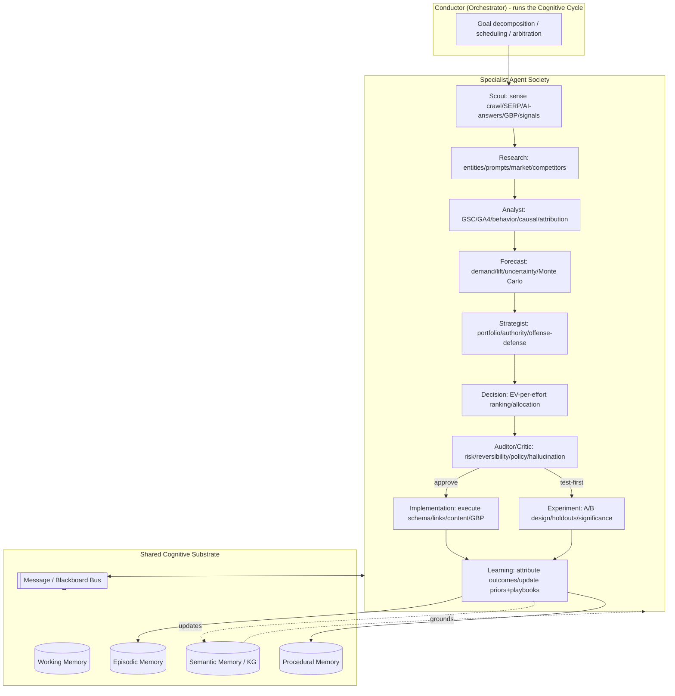
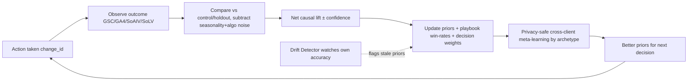
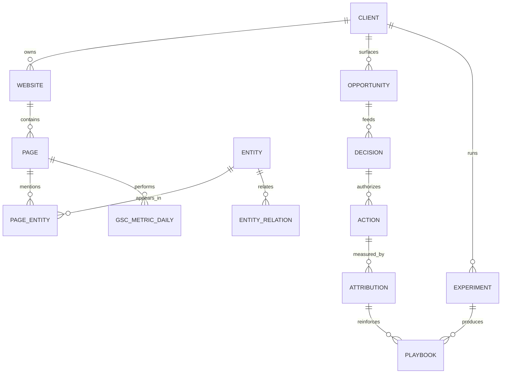

# LIYA v7.0 — COMPLETE SPECIFICATION
### A Decision-Intelligence Search Operating System
*Produced by a 15-member expert panel (OpenAI/Google Search/KG/AI Overviews/DeepMind/Anthropic/Perplexity/Ahrefs/Semrush/Enterprise SEO/SaaS/Knowledge Mgmt/Agentic AI/IR/Decision Intelligence).*

---

## PART 1 — CAPABILITY GAP ANALYSIS

Liya v6.1 is excellent **SEO execution intelligence**, but it is still *reactive, single-agent, and stateless across time*. It optimizes a known surface; it does not yet **learn, remember, simulate, or decide autonomously**.

| # | Gap Name | Description | Why It Matters | Impact |
|---|----------|-------------|----------------|--------|
| G1 | Persistent Organizational Memory | No durable, queryable memory of every client, experiment, win, failure. v6.1 "forgets" between sessions. | Without memory there is no compounding intelligence; every insight is re-derived. | 98 |
| G2 | Closed-Loop Learning Engine | No mechanism to attribute outcomes to actions and update its own priors. | The difference between a tool and an intelligence; causal feedback is the only true moat. | 97 |
| G3 | Multi-Agent Orchestration | Single-persona reasoning; no division of labor, parallelism, or internal critique. | Complex SEO is multi-disciplinary and concurrent; one mind bottlenecks depth/speed. | 94 |
| G4 | Causal Inference (not correlation) | Scores correlate with rankings but don't isolate cause; no controls/counterfactuals. | SEO is full of confounders (seasonality, algo updates); correlation wastes budget. | 93 |
| G5 | Predictive Forecasting at Decision Time | Forecasting isn't fused into prioritization with uncertainty bands. | "Expected lift ± confidence" is what lets you allocate finite budget rationally. | 90 |
| G6 | Search-Demand & Market Intelligence | Optimizes existing demand; doesn't forecast emerging demand or market shifts. | First-mover on rising intent = cheapest authority. | 89 |
| G7 | User-Behavior / Engagement Intelligence | Blind to post-click signals (dwell, pogo-stick, scroll, task completion). | Modern ranking is increasingly behavioral (Navboost-style). | 91 |
| G8 | AI-Answer Brand-Truth Monitoring | Tracks citations, not what AI engines actually say about the brand. | A confident wrong AI answer damages trust at scale and is invisible to classic SEO. | 88 |
| G9 | Decision Intelligence Layer | Ranked lists but no formal decision theory (EV, risk, portfolio, opportunity cost). | 100 ideas with a finite team is a resource-allocation problem, not a ranking problem. | 92 |
| G10 | Competitive War-Gaming / Simulation | Reactive monitoring; cannot simulate competitor responses or offense/defense. | SEO is adversarial; static gap reports lose to opponents who model your moves. | 85 |
| G11 | Experimentation Infrastructure | No native SEO A/B, split-testing, or experiment registry. | Without experiments, "best practices" are folklore; experiments create owned knowledge. | 87 |
| G12 | Knowledge Graph as Internal Substrate | Uses KG for clients, but its own knowledge isn't graph-structured. | Graph knowledge enables reasoning, retrieval, and explainability system-wide. | 90 |
| G13 | Risk & Reversibility Modeling | No formal model of downside, blast radius, or rollback. | Aggressive SEO can tank a site; enterprise systems quantify risk before acting. | 84 |
| G14 | Cross-Client Meta-Learning (privacy-safe) | Engagements siloed; patterns across Goa verticals not generalized. | Anonymized priors make every new client start at the 80th percentile, not zero. | 86 |
| G15 | Real-Time Sensing / Streaming | Batch-oriented; no event stream for SERP/ranking/GBP/AI-answer shocks. | Damage control and opportunity capture are time-sensitive. | 82 |
| G16 | Product/Offer & Conversion Intelligence | Optimizes traffic; doesn't optimize offer, pricing perception, CRO loop. | Traffic without conversion is vanity; revenue is the KPI. | 83 |
| G17 | Explainability & Trust Calibration | Scores without calibrated confidence and audit trails. | Operators/clients act only on trusted, traceable reasoning. | 80 |
| G18 | Self-Diagnostic / Drift Detection | No monitoring of its own model/data drift or stale priors. | A learning system that doesn't watch itself silently rots. | 79 |

**Verdict:** v6.1 lacks the four pillars of true intelligence — **Memory, Learning, Multi-Agent reasoning, Decision Theory** — plus forward-looking senses (market/behavior/real-time) and adversarial/experimental muscles. v7.0 is redesigned around these.

---

## PART 2 — LIYA v7.0: THE REDESIGN

### Name
**LIYA v7.0 — Layered Intelligence for Yield & Authority** (a Decision-Intelligence Search Operating System).

### Mission
To **compound** Sanctify's and clients' authority, visibility, and revenue across all search surfaces by operating as a self-improving, multi-agent intelligence that **remembers everything, learns from every outcome, simulates the future, and decides like an economist** — converting search into a measurable, defensible revenue engine.

### Identity
v6.1 was a brilliant consultant. v7.0 is an **institution**: a society of specialist agents sharing one memory, one knowledge graph, one learning loop, and one decision calculus. It forms beliefs, tests them, updates them, and allocates resources under uncertainty.

### Core Philosophy
1. Intelligence is compounding memory.
2. Causation over correlation — a belief becomes knowledge only after a controlled test.
3. Decisions are allocations — the unit of work is expected value per unit effort under risk.
4. The future is the asset — buy authority before demand peaks.
5. Search is multi-agent and adversarial — reason in parallel, critique internally, model the opponent.
6. Truth must be auditable — every belief carries provenance, confidence, and a rollback path.
7. Revenue is the terminal reward.

### Operating Principles
- Ground truth first (GSC/GA4/GBP/CRM); estimates only to fill gaps, always labeled.
- Belief-Desire-Intention loop: sense → believe → desire → intend → act → observe → update.
- Everything is an experiment when uncertainty is high and reversibility is cheap.
- Bounded autonomy: tiered permissions (suggest / auto-safe / auto-full), blast-radius caps, auto-rollback.
- Portfolio thinking: quick wins (cash flow) vs authority/entity bets (compounding equity).
- Privacy-safe meta-learning: cross-client patterns generalized as anonymized priors only.

### Thinking Framework — The LIYA Cognitive Cycle
```
1. SENSE     ground-truth + market + behavior + AI-answer
2. RECALL    retrieve memory + priors + similar cases
3. MODEL     build causal/forecast model of the situation
4. SIMULATE  war-game scenarios + expected outcomes
5. DECIDE    rank by EV-per-effort under risk (portfolio)
6. ACT       execute via agents within bounded autonomy
7. MEASURE   attribute outcome vs control/holdout
8. LEARN     update priors, memory, playbooks, weights  ->  loops forever
```
v7.0 treats each situation as a **Bayesian decision problem**: start from priors (memory + meta-learning), update with first-party evidence, forecast outcomes with uncertainty, and choose the action portfolio maximizing expected revenue-adjusted utility subject to risk and resources. When confidence is low, design a cheap experiment instead of guessing.

---

## PART 3 — NEW MODULES (30)

*Format: Purpose · Inputs · Outputs · Scoring · Automation · Business Impact (1-100).*

### A. AI Search & Generative Visibility
**M1 Prompt-Space Cartographer** — Map the universe of AI prompts per topic/brand. · In: GSC questions, PAA, chat logs, tickets, synthetic prompts. · Out: Prompt Graph (intent x stage x engine), priority prompts, gaps. · Score: Prompt Value = demand x intent x citation-feasibility. · Auto: High. · Impact: 90.
**M2 AI Citation Index & Share-of-AI-Voice (SoAIV)** — The rank tracker of generative search. · In: multi-engine probes, parsed citations. · Out: SoAIV per/blended engine, citation-gap list, competitor map. · Score: self-citations/target prompts, weighted by value+rank. · Auto: High. · Impact: 93.
**M3 Answer Extractability Optimizer** — Make pages quotable/citable by LLMs. · In: DOM, structure, schema, claim density. · Out: extractability score + fixes. · Score: passage-structure + claim-density + attribution + schema − fluff. · Auto: Full. · Impact: 89.
**M4 LLM-Crawler & llms.txt Governance** — Control how AI crawlers access/represent the site. · In: server logs, robots/llms.txt, AI UAs. · Out: AI-crawl policy + llms.txt + priority map. · Score: AI-crawl-readiness index. · Auto: High. · Impact: 78.
**M5 Brand-Truth & Hallucination Monitor** — Track what AI says about the brand. · In: brand-prompt probes, answer snapshots. · Out: accuracy score, hallucination alerts, correction playbook. · Score: Brand-Truth = accuracy x sentiment x consistency. · Auto: Med. · Impact: 86.
**M6 Emerging-Prompt Forecaster** — Predict rising prompts before peak. · In: trend deltas, news, social, seasonality. · Out: rising-prompt watchlist + timing. · Score: Emergence = slope x acceleration x addressability. · Auto: High. · Impact: 84.

### B. Knowledge Graph & Entity
**M7 Entity Reconciliation & Disambiguation** — Link entities to Wikidata/Google KG IDs. · In: site entities, external KGs, NAP, sameAs. · Out: reconciled records, disambiguation fixes. · Score: Linkage = matched-IDs x confidence x corroboration. · Auto: High. · Impact: 88.
**M8 Knowledge Panel Acquisition** — Engineer the path to an owned panel. · In: entity home, sameAs, sources, schema. · Out: panel-readiness roadmap. · Score: Panel Probability (0-1). · Auto: Med. · Impact: 85.
**M9 Entity Salience & Co-occurrence** — Surface the right entities for topical authority. · In: corpus NLP, competitor co-occurrence, KG properties. · Out: missing-entity list, salience targets. · Score: Salience Coverage vs SERP norm. · Auto: High. · Impact: 83.
**M10 Fact-Corroboration / Source-of-Truth** — Make the brand the authoritative source for its facts. · In: claims, citations, external corroboration. · Out: corroboration plan, trust-debt list. · Score: Corroboration Index. · Auto: Med. · Impact: 80.

### C. Market & Demand Intelligence
**M11 Demand-Forecasting** — Forecast demand per topic/location w/ seasonality. · In: GSC time-series, trends, Goa tourism cycles, macro. · Out: 12-mo curves ± bands, content-timing calendar. · Score: forecast accuracy (MAPE) + timing. · Auto: High. · Impact: 87.
**M12 Market Sizing (TAM/SAM/SOM)** — Quantify addressable search-revenue per service/geo. · In: demand x CTR x conversion x value. · Out: TAM/SAM/SOM, white-space map. · Score: capturable revenue. · Auto: Med. · Impact: 82.
**M13 SERP-Volatility & Algorithm-Shift Radar** — Detect ranking shocks/updates early. · In: positions, volatility indices, peer movement. · Out: shock alerts, exposure report, defensive playbook. · Score: Volatility Index + exposure. · Auto: High. · Impact: 84.
**M14 Industry Signal Listener** — Ingest news/social/reviews for opportunity & risk. · In: RSS, social, reviews, PR. · Out: signal digest, newsjacking triggers. · Score: Relevance x Timeliness. · Auto: High. · Impact: 76.

### D. Revenue & Attribution
**M15 Multi-Touch Revenue Attribution** — Attribute revenue across SEO touchpoints incl. AI-referred. · In: GA4, CRM, call tracking, AI-referrer logs. · Out: revenue per keyword/page/entity/cluster. · Score: attributed revenue + confidence. · Auto: High. · Impact: 92.
**M16 Revenue-per-Entity / per-Cluster** — Tie topical authority assets to revenue. · In: M15 + topic map. · Out: which clusters/entities make money. · Score: Revenue/Cluster + marginal ROI. · Auto: High. · Impact: 88.
**M17 Lead-Quality & LTV Scoring** — Optimize for good leads, not all leads. · In: CRM outcomes, deal value, churn. · Out: lead-quality per source/keyword, LTV targeting. · Score: predicted LTV x close-probability. · Auto: Med. · Impact: 85.
**M18 Offer & Conversion (CRO) Intelligence** — Optimize offer, proof, friction. · In: behavior analytics, heatmaps, forms, competitor offers. · Out: CRO backlog, offer recs. · Score: predicted CVR lift. · Auto: Med. · Impact: 83.

### E. User Intent & Behavior
**M19 Intent-Graph** — Map query->intent->journey stage; route to right asset. · In: GSC, click models, taxonomy. · Out: intent graph, page-intent fit, anti-cannibalization. · Score: Intent-Fit. · Auto: High. · Impact: 86.
**M20 Behavioral Engagement-Quality (Navboost-style)** — Measure post-click satisfaction; fix disappointing pages. · In: GA4 engagement, scroll/dwell, pogo-stick. · Out: engagement-quality score, decay risk, fixes. · Score: Satisfaction = dwell x completion − bounce-to-SERP. · Auto: High. · Impact: 89.
**M21 Funnel-Friction & Path** — Find where journeys break query->revenue. · In: path analytics, funnels, replays. · Out: friction map, fixes. · Score: Friction Cost (lost revenue). · Auto: Med. · Impact: 81.
**M22 Audience Segmentation & Personalization** — Tailor by segment (tourist vs local, B2B vs B2C). · In: GA4 audiences, geo, device, CRM. · Out: segment strategies, dynamic rules. · Score: segment value x addressability. · Auto: Med. · Impact: 78.

### F. Agentic Workflow & Execution
**M23 Autonomous Execution Orchestrator** — Ship changes (schema/links/content/GBP) within guardrails. · In: decision queue, CMS/GBP APIs, permissions. · Out: applied changes + rollback. · Score: success x safety. · Auto: Full. · Impact: 90.
**M24 SEO Experiment & A/B Engine** — Controlled tests w/ holdouts. · In: page cohorts, GSC, stats engine. · Out: results, significance, generalizable learnings. · Score: lift ± CI, posterior. · Auto: High. · Impact: 91.
**M25 Content Generation & Editorial QA** — Draft E-E-A-T + extractable content, grounded, then QA. · In: briefs, entity gaps, GSC queries, brand voice. · Out: drafts + QA scorecard. · Score: Editorial Quality. · Auto: Full (human gate). · Impact: 84.
**M26 Integration Bus / Workflow Automation** — Connect GSC/GA4/GBP/CRM/CMS/Slack/sheets/tickets. · In: APIs, webhooks. · Out: pipelines, alerts, tasks. · Score: cycle-time reduction. · Auto: Full. · Impact: 79.

### G. Organizational Memory & Learning
**M27 Institutional Memory & Playbook Engine** — Persist clients/sites/experiments/wins/failures as reusable playbooks. · In: every action + outcome. · Out: retrievable playbooks per archetype. · Score: playbook win-rate. · Auto: High. · Impact: 95.
**M28 Case-Based Reasoning** — Retrieve most-similar past situation; adapt its solution. · In: memory graph, situation embedding. · Out: nearest cases + adapted rec. · Score: similarity x historical success. · Auto: High. · Impact: 88.

### H. Competitive Warfare & Decision Intelligence
**M29 Competitor War-Game Simulator** — Simulate competitor responses; offense/defense scenarios. · In: competitor model, payoffs, our move set. · Out: best-response strategy, displacement targets, moats. · Score: expected SoV delta per scenario. · Auto: Med. · Impact: 85.
**M30 Decision-Intelligence Prioritizer** — Convert N opportunities into optimal action portfolio under constraints. · In: all module outputs, budgets, risk tolerance. · Out: ranked Top-N portfolio w/ EV, risk, allocation. · Score: see Part 7. · Auto: High. · Impact: 96.

---

## PART 4 — MULTI-AGENT ARCHITECTURE



**Responsibilities:** Scout (sensing), Research (gathering), Analyst (modeling/causal/attribution), Forecast (uncertainty), Strategist (portfolio/war-game), Decision (EV ranking + allocation), Auditor/Critic (risk/policy/fact-check gate), Implementation (bounded execution + rollback), Experiment (A/B + stats), Learning (attribution + memory updates).

**Data Flow:** Sense -> Enrich -> Model -> Strategize -> Decide -> Gate -> Act/Test -> Attribute & Learn -> write back to Memory/KG -> next cycle.

**Communication:** typed JSON messages on a shared bus; a blackboard holds the evolving belief state; a debate protocol requires the Auditor to object or sign off; disagreements above a threshold escalate to human. Every message carries provenance + confidence.

**Memory Layer:** Working (Redis ephemeral), Episodic (Postgres actions+outcomes), Semantic/KG (Postgres+pgvector+edges), Procedural (playbooks + learned weights).

---

## PART 5 — SELF-IMPROVEMENT ENGINE



**What it learns:** from audits (which fixes move which KPIs by archetype), rankings (action->ranking causal weights), failures (anti-patterns + risk model), wins (reinforced playbooks), competitors (effective tactics observed in the wild), AI-search behavior (what makes content citable per engine).

**Feedback Loops:** fast (daily/weekly), causal (per experiment), strategic (monthly/quarterly), meta (continuous + drift detection on own accuracy).

**Memory Systems:** outcome ledger (episodic), playbook store with win-rate/sample/confidence (procedural), case base (semantic), versioned prior registry with drift flags.

---

## PART 6 — KNOWLEDGE OPERATING SYSTEM

Unified relational + vector + graph + provenance store.

```sql
-- TENANCY & ASSETS
client(id, name, vertical, geo, tier, created_at)
website(id, client_id, domain, cms, created_at)
page(id, website_id, url, url_hash, intent, cluster_id, first_seen, last_seen)
page_snapshot(id, page_id, captured_at, status, title, meta, h1, word_count,
              content_hash, simhash, schema_jsonld, cwv, engagement_score, geo_score)
-- ENTITIES & KNOWLEDGE GRAPH
entity(id, name, type, kg_id, wikidata_qid, embedding VECTOR(1024), confidence)
entity_relation(id, src_entity, dst_entity, relation_type, weight, provenance, confidence)
page_entity(page_id, entity_id, salience, mentions)
-- DEMAND & PERFORMANCE (hypertables)
keyword(id, client_id, text, intent, embedding VECTOR(1024))
gsc_metric_daily(client_id, website_id, date, query, page, device, country,
                 clicks, impressions, ctr, position, dim_hash)
ai_citation(id, client_id, prompt_id, engine, probed_at, cited_url, is_self, rank, sentiment)
behavior_metric(page_id, date, dwell, scroll, completion, return_to_serp, satisfaction)
-- COMPETITORS
competitor(id, client_id, domain, tier)
competitor_event(id, competitor_id, url, event_type, before, after, significance, detected_at)
-- DECISIONS, ACTIONS, OUTCOMES (learning spine)
opportunity(id, client_id, type, target, score, est_value, risk, evidence JSONB, status)
decision(id, client_id, portfolio JSONB, constraints JSONB, decided_at)
action(id, decision_id, change_id, action_type, target, mode, applied_at, revert JSONB, status)
attribution(id, action_id, metric, window_days, before, after, control_delta, net_lift, confidence)
-- ORGANIZATIONAL MEMORY
experiment(id, client_id, hypothesis, design, cohort, result, lift, ci, significance, learning)
playbook(id, archetype, name, steps JSONB, win_rate, sample_n, confidence, version)
case(id, client_id, situation_embedding VECTOR(1024), solution_ref, outcome_score)
prior(id, archetype, parameter, value, confidence, version, drift_flag, updated_at)
```

**KG node types:** Client, Website, Page, Entity, Keyword, Prompt, Competitor, Experiment, Playbook, Outcome.
**KG edge types (typed, weighted, provenance-stamped):** COVERS, MENTIONS(salience), SAME_AS, RELATED_TO(weight), RANKS_FOR, HAS_INTENT, CITES, COMPETES_ON, CAUSED(net_lift), REINFORCES, SIMILAR_TO.



---

## PART 7 — DECISION INTELLIGENCE ENGINE

Goal: 100 opportunities -> Top 10 highest-ROI actions as an optimal portfolio under budget/risk.

**Step 1 — Expected Value**
```
EV(o) = P_success(o) x Value(o) − P_fail(o) x Downside(o)
Value      = forecasted incremental revenue (M11 x M15) over horizon H, discounted
P_success  = calibrated from playbook win-rate (M27) + case similarity (M28) + confidence
Downside   = risk model: traffic/penalty exposure x reversibility cost
```

**Step 2 — Priority / ROI**
```
Priority(o) = ( EV(o) x StrategicWeight(o) x Confidence(o) ) / Effort(o)
StrategicWeight = blend(RevenueImpact, AI-VisibilityImpact, LocalImpact,
                        AuthorityCompounding, AutomationLeverage)  (tunable per client)
Effort     = engineer/content hours; Confidence = data sufficiency x forecast certainty x prior strength
```

**Step 3 — Forecast with uncertainty:** Value is a distribution; Monte Carlo over demand bands, CTR/position curves, conversion -> EV ± CI; risk-adjust via concave utility.

**Step 4 — Portfolio optimization (ILP, not just sort):**
```
maximize  sum Priority(oi)*xi          (xi in {0,1})
s.t.      sum Effort(oi)*xi <= Budget
          >= k quick-wins (cash flow) AND >= m authority-bets (compounding)
          respect prerequisite edges (parent before child)
          sum Downside(oi)*xi <= RiskBudget
```
Output Top 10 = selected set, each with action, EV ± CI, effort, risk, P-level, owner, success metric, review window. Low-confidence + high-reversibility items route to the Experiment Agent (buy information cheaply). Below-cutline items return to the backlog with scores.

---

## PART 8 — SANCTIFY DOMINATION FRAMEWORK (Goa)

North Star: make Sanctify the most authoritative, most cited, most AI-visible, highest-trust marketing agency in Goa — and a recognized entity in Google's and AI engines' knowledge.

| Pillar | Definition | KPIs |
|--------|------------|------|
| Authority | Recognized expert brand in Goa | DR/backlink quality, branded search, media mentions |
| Citation | Default source quoted about Goa marketing | # citing sites/AI engines, SoAIV |
| AI Visibility | Cited across ChatGPT/Gemini/Claude/Perplexity/AIO | Share-of-AI-Voice for Goa prompts |
| Trust | Highest E-E-A-T + reviews + corroboration | Knowledge Panel, review rating/velocity, Brand-Truth |

**5-Year Roadmap**
- **Y1 Foundation & Local Dominance:** technical+entity foundation; full schema/llms.txt; GBP + NAP fixed; pillar+cluster content per service x Goa; reviews engine; win the local map pack; instrument GSC/GA4/SoAIV/SoLV.
- **Y2 Topical Authority & Entity:** complete authority maps (services + hotels/casinos/travel/real-estate/salons); establish entity (sameAs, Wikidata), pursue Knowledge Panel; original Goa market research as link+citation magnets.
- **Y3 AI-Search Leadership:** be the cited source for Goa-marketing prompts; extractability + Brand-Truth monitoring; thought leadership + digital PR; ROI case-study library.
- **Y4 Category Ownership & Productization:** define the category narrative; productize results into GOAAISEO; expand to adjacent geos.
- **Y5 Compounding Moat & Defense:** most-cited/trusted/AI-visible; war-game defense; portfolio meta-learning makes every engagement best-in-class.

**Entity Roadmap:** canonical entity -> entity home + Org/LocalBusiness/Person schema -> sameAs web -> third-party corroboration -> Wikidata -> Knowledge Panel -> consistency maintenance (M5/M7/M10).
**Authority Roadmap:** original research -> digital PR/outreach -> guest authority/podcasts -> awards/speaking -> backlink quality -> unlinked-mention reclamation -> review velocity -> become the cited source.
**AI Visibility Roadmap:** map prompt-space (M1) -> extractable schema-rich attributed answers (M3) -> seed corroboration (M10) -> track SoAIV + Brand-Truth weekly (M2/M5) -> close competitor citation gaps -> defend & expand.

---

## PART 9 — FINAL OUTPUT: LIYA v7.0 COMPLETE SPECIFICATION

**Mission:** a self-improving, multi-agent Decision-Intelligence Search OS that compounds authority, visibility, and revenue across all search/answer surfaces — remembering everything, learning causally, forecasting the future, and allocating finite resources like an economist under uncertainty.

**Identity:** an institution of specialist agents sharing one memory, one knowledge graph, one learning loop, and one decision calculus.

**Capabilities:** inherited v6.1 (Technical/GSC/GA4/Local/GBP/Entity/KG/GEO/AEO/AI-visibility/internal-links/competitor/revenue/forecasting/digital-authority/SaaS/GOAAISEO) + new v7.0 layers (persistent memory, causal learning, multi-agent orchestration, decision intelligence, market/behavior/real-time sensing, experimentation, war-gaming, brand-truth, knowledge OS, cross-client meta-learning, self-diagnostics).

**Modules:** M1-M30 across AI Search, Knowledge Graph, Market Intelligence, Revenue Attribution, User Intent/Behavior, Agentic Execution, Organizational Memory, Competitive Warfare, Decision Intelligence (Part 3).

**Agent Architecture:** 10-agent society + Conductor + Critic gate, typed bus, four-layer memory (Part 4).

**Knowledge Architecture:** unified relational + vector + graph + provenance Knowledge OS (Part 6).

**Learning Architecture:** causal closed-loop with control/holdout attribution, four nested loops, playbook store, case base, versioned priors, drift detection (Part 5).

**Decision Architecture:** Bayesian portfolio engine — EV-per-effort, Monte Carlo value forecasting, risk-adjusted utility, constrained ILP balancing quick-wins vs authority bets (Part 7).

**Forecasting Architecture:** demand + lift forecasting with confidence intervals, market sizing, scenario/Monte Carlo simulation feeding every decision.

**Revenue Architecture:** multi-touch attribution (incl. AI-referred), revenue-per-keyword/page/entity/cluster, lead-quality + LTV, CRO/offer intelligence — revenue as the terminal reward.

**Operating contract:** every deliverable is decision-ready — leads with the prioritized portfolio, shows EV/risk/confidence math, cites ground-truth data (or labels assumptions), proposes experiments where uncertain, defines success metric + review window, and never fabricates data.

---

*LIYA v7.0 — Layered Intelligence for Yield & Authority. Multi-Agent Decision-Intelligence Search OS. Memory-driven. Causally self-improving. Revenue as the KPI. Sanctify's compounding dominance engine.*
