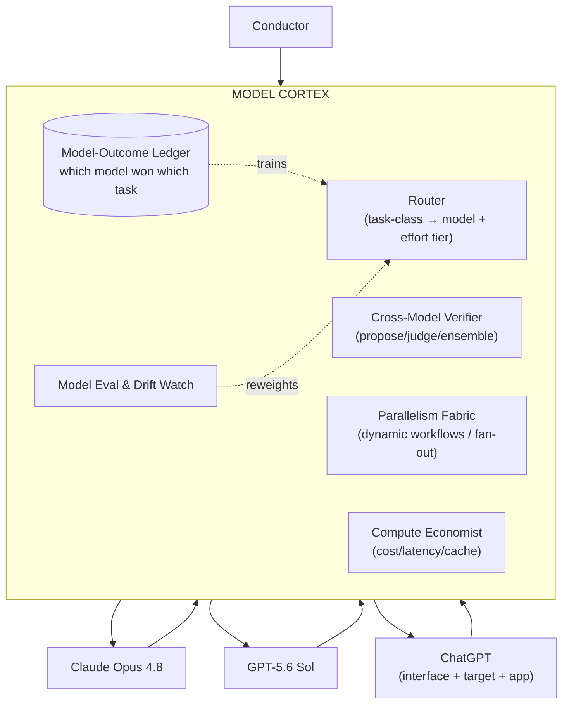
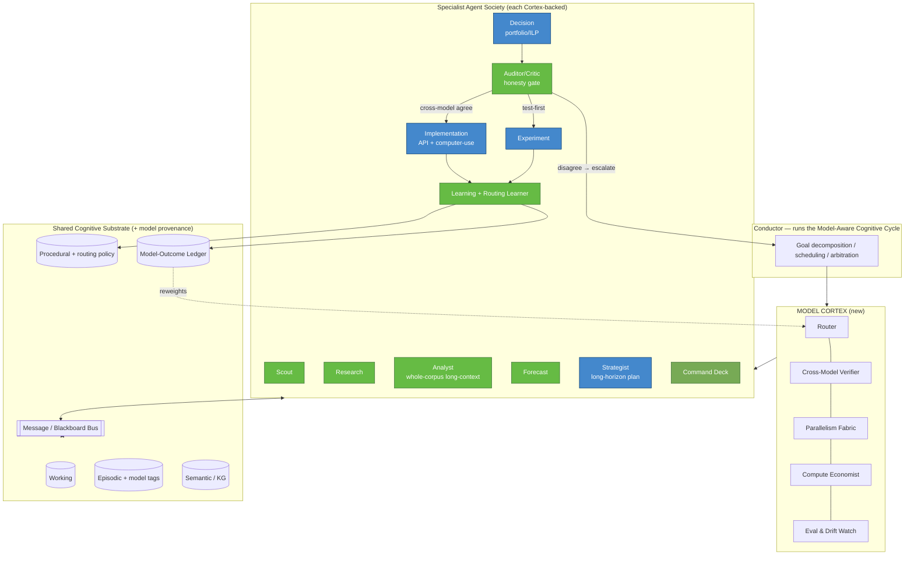
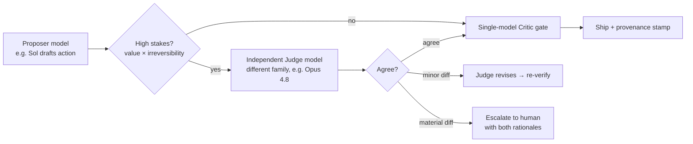

# LIYA v8.0 — COMPLETE SPECIFICATION
### A Multi-Model Decision-Intelligence Search Operating System
*Successor to LIYA v7.0. Produced by an 18-member expert panel (OpenAI / Anthropic / Google Search / KG / AI Overviews / DeepMind / Perplexity / Ahrefs / Semrush / Enterprise SEO / SaaS / Knowledge Mgmt / Agentic AI / IR / Decision Intelligence / LLM Systems / MLOps / AI Safety & Alignment).*

> **What changed from v7.0 → v8.0 in one sentence:** v7.0 was a *society of specialist agents* sharing one memory, one graph, one learning loop, and one decision calculus — but it ran on a **single, undifferentiated model**. v8.0 makes the *intelligence itself heterogeneous*: it routes every agent, task, and gate to the **frontier model that is measurably best for it** — **Claude Opus 4.8**, **GPT-5.6 Sol**, and **ChatGPT** — and adds a cross-model verification, massive-parallelism, and computer-use execution layer on top of everything v7.0 already did.

---

## PART 0 — WHAT v8.0 INHERITS FROM v7.0 (UNCHANGED, STILL LOAD-BEARING)

v8.0 is a **superset** of v7.0. Everything below is retained verbatim and remains the substrate:

- The **LIYA Cognitive Cycle** (Sense → Recall → Model → Simulate → Decide → Act → Measure → Learn).
- The **30 modules M1–M30** across AI Search, Knowledge Graph, Market Intelligence, Revenue Attribution, User Intent/Behavior, Agentic Execution, Organizational Memory, Competitive Warfare, and Decision Intelligence.
- The **10-agent society + Conductor + Critic gate** and the four-layer memory (Working / Episodic / Semantic-KG / Procedural).
- The **causal closed-loop learning engine** (control/holdout attribution, four nested loops, drift detection).
- The **Knowledge Operating System** (relational + vector + graph + provenance).
- The **Bayesian portfolio Decision Engine** (EV-per-effort, Monte Carlo, risk-adjusted utility, constrained ILP).
- The **Sanctify Domination Framework** for Goa (Authority / Citation / AI-Visibility / Trust; 5-year roadmap).

v8.0 adds **one new architectural layer that sits beneath all agents** (the *Model Cortex*), **12 new modules (M31–M42)**, a **cross-model verification protocol**, a **massively-parallel execution fabric**, a **computer-use action surface**, and a **model-economics layer** in the decision calculus.

---

## PART 1 — v7.0 → v8.0 CAPABILITY GAP ANALYSIS

v7.0 has Memory, Learning, Multi-Agent reasoning, Decision Theory, and forward senses. Its remaining weakness is that **it treats "the model" as a constant**. In a world where three frontier families ship every ~6 weeks with *divergent, measurable strengths*, a single-model system leaves compounding advantage — accuracy, speed, cost, safety — on the table.

| # | Gap Name | Description | Why It Matters | Impact |
|---|----------|-------------|----------------|--------|
| H1 | **Model Monoculture** | v7.0 runs every agent on one model. Each frontier model now has distinct edges (honesty/alignment, factual accuracy, long-horizon planning, computer-use). | Using one model for everything means every task is run on a tool that is second-best at most of them. | 96 |
| H2 | **No Heterogeneous Routing** | No mechanism to send the *right task* to the *right model* under cost/latency/accuracy constraints. | Routing is the single highest-leverage lever for quality-per-dollar in a multi-model era. | 95 |
| H3 | **No Cross-Model Verification** | A single model's answer is both proposer and judge; no independent second opinion on high-stakes claims. | Ensemble/adversarial verification catches hallucinations one model is blind to; it is the cheapest reliability upgrade. | 94 |
| H4 | **Bounded Parallelism** | v7.0's 10 agents run largely sequentially per cycle; no fan-out to hundreds of concurrent workers. | Site-wide SEO (10k+ pages, thousands of prompts) is embarrassingly parallel; serial execution caps depth and speed. | 92 |
| H5 | **No Computer-Use Execution** | Execution is API-only (CMS/GBP APIs). Surfaces without APIs (legacy dashboards, GBP UI edge cases, competitor tools) are unreachable. | A huge fraction of real SEO ops lives in UIs; API-only autonomy has a hard ceiling. | 88 |
| H6 | **No Effort/Cost Tiering** | v7.0 decides *what* to do but not *how much compute* to spend deciding it. | Frontier families now expose effort tiers (fast/standard/ultra); matching effort to stakes is pure margin. | 89 |
| H7 | **No Whole-Corpus Reasoning** | Retrieval-only grounding; the system never reasons over an entire site + history in one context. | 1M-token context windows allow holistic reasoning (cannibalization, silo integrity) that chunked retrieval misses. | 90 |
| H8 | **No Honesty/Alignment Gate** | The Auditor/Critic is a prompt, not a model *selected for* flagging its own errors and refusing over-optimization. | Aggressive SEO can penalize a site; an alignment-hardened judge is the difference between safe and reckless autonomy. | 91 |
| H9 | **No Model-Drift / Regression Watch** | Models update every few weeks; v7.0 has no eval harness to detect quality regressions when a model version changes. | A silent model regression can degrade every downstream decision; MLOps discipline is mandatory at frontier cadence. | 87 |
| H10 | **ChatGPT Treated Only as a Target** | v7.0 probes ChatGPT for citations but doesn't use it as a distribution/interface surface or a native action app. | The engine you optimize *for* is also a channel you can publish *into* and converse *through*. | 84 |
| H11 | **No Model-Provenance in Memory** | Outcomes aren't tagged with which model produced the action, so the system can't learn which model wins which task. | Without model attribution, LIYA can't self-optimize its own routing table — the meta-moat of a multi-model system. | 90 |
| H12 | **No Prompt-Cache / Mid-Task Steering Economy** | v7.0 restates context each call; it doesn't exploit prompt caching or mid-conversation system-message updates. | These directly cut cost and latency on long agentic loops — the dominant cost center of an always-on operator. | 82 |

**Verdict:** v7.0 is a brilliant single-brained institution. v8.0 gives it **many brains, each chosen for what it is best at**, plus the plumbing to verify them against each other, run hundreds of them at once, spend the right amount of compute on each, and *learn which brain wins which job*. This is the **Model Cortex**.

---

## PART 2 — LIYA v8.0: THE REDESIGN

### Name
**LIYA v8.0 — Layered Intelligence for Yield & Authority, Multi-Model Edition** (a Multi-Model Decision-Intelligence Search Operating System).

### Mission
To **compound** Sanctify's and clients' authority, visibility, and revenue across every search and answer surface by operating as a self-improving, **multi-model, multi-agent** intelligence that remembers everything, learns from every outcome, simulates the future, decides like an economist, **and routes every unit of cognition to the frontier model that is provably best for it — then verifies the result across models before it ships.**

### Identity
v7.0 was an *institution* with one shared mind. v8.0 is that same institution staffed by **three specialist frontier intellects** working under one Conductor:
- **Claude Opus 4.8** — the *deep reasoner, long-context analyst, honest auditor, and swarm foreman*.
- **GPT-5.6 Sol** — the *long-horizon planner, agentic executor, computer-use operator, and factual-accuracy anchor*.
- **ChatGPT** — the *conversational interface, publishing/distribution surface, and the primary generative-search battleground LIYA optimizes for*.

### Core Philosophy (v7.0's seven principles + four new)
1–7. *(Retained from v7.0: compounding memory; causation over correlation; decisions are allocations; the future is the asset; search is multi-agent and adversarial; truth must be auditable; revenue is the terminal reward.)*
8. **The best mind for the job.** Cognition is not fungible; route every task to the model that is measurably best at it under cost/latency/risk constraints.
9. **No single model is trusted alone on high stakes.** Independent cross-model verification is the cheapest reliability we can buy; a claim becomes actionable only after a second, different model agrees or the disagreement is escalated.
10. **Compute is a portfolio, like everything else.** Match effort tier to stakes: cheap-fast for reversible low-value work, high-effort for irreversible high-value decisions.
11. **The system optimizes its own routing.** LIYA tags every outcome with the model that produced it and learns which model wins which task — its routing table is itself a learned, drifting, self-improving asset.

### Operating Principles (additions to v7.0)
- **Route, don't default.** Every task carries a task-class; the Model Cortex picks the model + effort tier from a learned policy, never a hardcoded default.
- **Propose on one model, verify on another.** High-stakes and irreversible actions require agreement from an independent model family before the Critic gate approves.
- **Fan out, then converge.** Embarrassingly-parallel work (per-page GEO scoring, per-prompt probing, entity reconciliation) is dispatched to hundreds of concurrent sub-workers, then reduced.
- **Prefer APIs; fall back to computer-use.** Ship via typed APIs when they exist; use the computer-use operator for UI-only surfaces, always inside the same guardrails.
- **Watch the models like you watch the site.** A standing eval harness flags model regressions the moment a version changes; routing weights adjust automatically.

### Thinking Framework — The LIYA v8.0 Cognitive Cycle (Model-Aware)
```
0. ROUTE      classify task → pick model + effort tier from learned policy   [NEW]
1. SENSE      ground-truth + market + behavior + AI-answer
2. RECALL     retrieve memory + priors + similar cases (+ which model won them) [NEW]
3. MODEL      build causal/forecast model of the situation
4. SIMULATE   war-game scenarios + expected outcomes
5. DECIDE     rank by EV-per-effort under risk AND compute-cost (portfolio)   [EXT]
6. ACT        execute via agents (API or computer-use) within bounded autonomy [EXT]
7. VERIFY     independent cross-model check on high-stakes outputs            [NEW]
8. MEASURE    attribute outcome vs control/holdout
9. LEARN      update priors, memory, playbooks, weights AND routing table     [EXT]
             ->  loops forever
```

---

## PART 3 — THE MODEL CORTEX (THE CORE NEW LAYER)

The **Model Cortex** is the layer between the Conductor and every agent. It owns model selection, effort tiering, cross-model verification, prompt-cache economics, and the model-outcome ledger. No agent talks to a model directly; it talks to the Cortex.



### 3.1 Model Roster & Capability Profiles

Capabilities below are grounded in public vendor/documentation as of mid-2026; each factual claim is sourced. *Content was rephrased for compliance with licensing restrictions.*

#### Claude Opus 4.8 — *The Deep Reasoner / Honest Auditor / Swarm Foreman*
- **Context & output:** 1M-token context window by default on the API/Bedrock/Vertex (200k on Microsoft Foundry); up to 128k output tokens; adaptive thinking. [[Anthropic docs — what's new]](https://platform.claude.com/docs/en/about-claude/models/whats-new-claude-4-7)
- **Massive parallelism:** Claude Code "dynamic workflows" can orchestrate large-scale problems across **hundreds of parallel subagents**; fast mode runs ~2.5× faster and ~3× cheaper than prior models. [[Anthropic — Introducing Opus 4.8]](https://www.anthropic.com/news/claude-opus-4-8), [[codersera]](https://codersera.com/blog/claude-opus-4-8-launch-guide-2026)
- **Honesty / alignment as a feature:** reported ~4× less likely than Opus 4.7 to let a code flaw pass without flagging it — strong fit for a *critic/auditor* role. [[computingforgeeks]](https://computingforgeeks.com/claude-opus-4-8-released-features-benchmarks/)
- **Reasoning benchmarks:** ~88.6% SWE-bench Verified, 69.2% SWE-bench Pro, USAMO 2026 ~96.7% math, GDPval Elo ~1890 — while using ~35% fewer output tokens per task. [[o-mega]](https://o-mega.ai/articles/claude-opus-4-8-full-benchmark-and-cost-guide-2026), [[codersera]](https://codersera.com/blog/claude-opus-4-8-launch-guide-2026)
- **Mid-task steering:** accepts system messages inside conversation history after a user turn, so instructions can change mid-run **without restating the system prompt**, preserving prompt-cache hits and cutting cost on long agentic loops. [[Caylent]](https://caylent.com/blog/claude-opus-4-8-what-improved-whats-new-and-what-it-means-for-enterprise)

> **LIYA uses Opus 4.8 for:** whole-corpus long-context analysis (reason over an entire site + its history in one window), the Auditor/Critic honesty gate, causal reasoning, and as the *foreman* for hundred-way parallel sub-agent fan-outs.

#### GPT-5.6 Sol — *The Long-Horizon Planner / Agentic Executor / Factual Anchor*
- **Frontier agentic work:** positioned as state-of-the-art across coding, knowledge work, cybersecurity, and science, doing so **with fewer tokens and lower estimated cost** than prior/competing frontier models. [[OpenAI — GPT-5.6]](https://openai.com/index/gpt-5-6/)
- **Long-horizon planning & tool use:** advances long-horizon planning, agentic workflows, **computer use**, and reliability on demanding real-world tasks. [[OpenAI community — 5.6 series]](https://community.openai.com/t/introducing-gpt-5-6-series-sol-terra-and-luna/1384931), [[kingy.ai]](https://kingy.ai/blog/gpt-5-6-sol-terra-luna-benchmarks-specs/)
- **Factual accuracy:** independent 16-task blind testing reported the cleanest factual-accuracy record measured for the family — strong fit for a *grounding / fact-corroboration anchor*. [[sidsaladi]](https://sidsaladi.substack.com/p/gpt-56-101-the-complete-guide-40)
- **Tiered architecture & effort:** ships as a three-tier family (Sol / Terra / Luna) with reasoning modes and a compute-intensive **Sol Ultra** high-effort variant (e.g., ~91.9% TerminalBench 2.1), plus updated prompt-caching mechanics for production routing. [[buildfastwithai]](https://www.buildfastwithai.com/blogs/gpt-5-6-review-sol-terra-luna-2026), [[globaltechcouncil]](https://www.globaltechcouncil.org/ai/gpt-5-6/)

> **LIYA uses GPT-5.6 Sol for:** the Strategist/Planner (long-horizon roadmaps), the Implementation agent's **computer-use** execution on UI-only surfaces, ground-truth fact-corroboration (M10), and any high-stakes decision needing the factual-accuracy anchor. Effort tier scales from Luna/Terra (cheap, reversible tasks) up to **Sol Ultra** (irreversible, high-value decisions).

#### ChatGPT — *The Interface / Distribution Surface / Primary Battleground*
ChatGPT plays a **triple role** in v8.0 (v7.0 used it only as a citation target):
1. **Optimization target (retained):** ChatGPT Search is a primary generative engine LIYA probes for citations and Share-of-AI-Voice (M2/M5) and optimizes extractability for (M3).
2. **Conversational interface (new):** operators and clients converse with LIYA *through* a ChatGPT-fronted app — natural-language queries against the whole Knowledge OS, daily-report Q&A, and approvals.
3. **Distribution / publishing surface (new):** LIYA publishes structured, citable brand knowledge into the ChatGPT ecosystem (apps/actions), closing the loop between "content we ship" and "answers users get."

### 3.2 Routing Policy — Task-Class → Model → Effort Tier

The Router maps each task-class to a model and effort tier via a **learned policy** (bootstrapped from the table below, then continuously reweighted by the Model-Outcome Ledger).

| Task-class (agent) | Primary model | Effort tier | Verifier (2nd model) | Rationale |
|---|---|---|---|---|
| Whole-corpus analysis / cannibalization / silo integrity (Analyst) | **Opus 4.8** | standard→high | Sol (spot-check) | 1M context reasons over the whole site at once |
| Causal inference & attribution (Analyst/Learning) | **Opus 4.8** | high | Sol | deep reasoning, fewer tokens |
| Auditor / Critic honesty & risk gate | **Opus 4.8** | high | Sol on veto | alignment-hardened; flags its own & others' flaws |
| Long-horizon strategy & roadmap (Strategist) | **GPT-5.6 Sol** | high→ultra | Opus 4.8 | best long-horizon planning |
| Decision portfolio / ILP framing (Decision) | **GPT-5.6 Sol** | high | Opus 4.8 | agentic tool use + math |
| Fact-corroboration / ground-truth checks (M10) | **GPT-5.6 Sol** | standard | Opus 4.8 | cleanest factual accuracy |
| Computer-use execution on UI-only surfaces (Implementation) | **GPT-5.6 Sol** | standard | Opus 4.8 gate | native computer-use |
| API execution (schema/links/GBP) (Implementation) | either (cost-routed) | fast→standard | Critic gate | commodity task, route on price |
| Massive parallel fan-out (per-page GEO, per-prompt probe) | **Opus 4.8** foreman + cheap-tier workers | fast | sampled | dynamic workflows / hundreds of subagents |
| Content drafting & editorial QA (M25) | **Sol** draft + **Opus 4.8** QA | standard | cross-read | dual-model draft/critic split |
| Conversational interface / reports / approvals | **ChatGPT** | fast | n/a | user-facing surface |
| Prompt-space & emerging-prompt forecasting (M1/M6) | **Opus 4.8** | standard | Sol | reasoning over large signal sets |

**Routing inputs:** task-class, stakes (reversibility × value), data volume (→ context strategy), latency SLA, remaining compute budget, and the *learned win-rate of each model on this task-class for this site archetype* (from the ledger).

### 3.3 Effort-Tier Economics (Compute Economist)
Every model family exposes effort/speed tiers (Opus 4.8 fast mode; Sol/Terra/Luna + Sol Ultra). The Compute Economist chooses the tier by **stakes-adjusted expected value of compute**:
```
Tier(task) = argmax_t [ ExpectedQualityGain(t) × Stakes(task) − Cost(t) − LatencyPenalty(t) ]
Stakes(task) = Value(task) × Irreversibility(task)
```
- Reversible, low-value, high-volume → **fast/cheap tiers** (Opus fast mode, GPT-5.6 Luna/Terra).
- Irreversible, high-value, one-shot → **high-effort tiers** (Opus high thinking, **Sol Ultra**).
- Long agentic loops exploit **prompt caching** and **mid-task system-message steering** (Opus 4.8) so context is not re-billed every turn.

---

## PART 4 — NEW MODULES (M31–M42)

*Format: Purpose · In · Out · Score · Auto · Impact (1-100). These extend v7.0's M1–M30.*

### I. Multi-Model Orchestration
**M31 Model Router & Policy Engine** — Route each task to the best model + effort tier. · In: task-class, stakes, budget, ledger win-rates. · Out: routing decision + rationale + fallback. · Score: quality-per-dollar vs single-model baseline. · Auto: Full. · Impact: 95.
**M32 Cross-Model Verification & Consensus** — Independent second-model check on high-stakes outputs; escalate on disagreement. · In: proposer output, task stakes. · Out: agree / revise / escalate + confidence. · Score: hallucination-catch rate, false-approval rate. · Auto: High. · Impact: 94.
**M33 Compute Economist** — Choose effort tier by stakes-adjusted EV of compute; manage prompt cache. · In: task value, reversibility, latency SLA, budget. · Out: tier + caching plan. · Score: cost saved at equal quality. · Auto: Full. · Impact: 88.
**M34 Model Eval & Drift Watch** — Standing benchmark harness (SEO-task golden sets) run on every model-version change. · In: golden tasks, model versions. · Out: per-task-class win-rates, regression alerts. · Score: regression detection latency. · Auto: High. · Impact: 87.
**M35 Model-Outcome Ledger & Routing Learner** — Tag every action with the model+tier that produced it; learn which model wins which task by archetype. · In: attribution (M15) + model tags. · Out: updated routing policy weights. · Score: routing policy lift over time. · Auto: High. · Impact: 90.

### J. Massive Parallelism & Execution
**M36 Dynamic-Workflow Swarm Orchestrator** — Fan out embarrassingly-parallel work to hundreds of concurrent sub-workers under an Opus 4.8 foreman, then reduce. · In: batch job (pages/prompts/entities), concurrency budget. · Out: aggregated result + per-worker provenance. · Score: throughput × correctness. · Auto: Full. · Impact: 91.
**M37 Computer-Use Execution Operator** — Ship changes on UI-only surfaces (legacy CMS, GBP UI edge cases, dashboards) via GPT-5.6 Sol computer-use, inside v7.0 guardrails + rollback. · In: task, credentials vault, guardrails. · Out: applied UI change + screen-recording audit + revert plan. · Score: success × safety. · Auto: Full (human gate on high-risk). · Impact: 86.
**M38 Whole-Corpus Long-Context Analyzer** — Load an entire site + its history into a 1M-token window for holistic reasoning (cannibalization, silo integrity, internal-link topology) that chunked retrieval misses. · In: full crawl + GSC history + topic map. · Out: site-wide structural findings. · Score: issues found vs chunked baseline. · Auto: High. · Impact: 89.

### K. ChatGPT Surface & Distribution
**M39 Conversational Command Deck** — Natural-language control of the whole Knowledge OS via a ChatGPT-fronted app (query truth graph, run cycles, approve actions). · In: user prompt, auth/permissions. · Out: grounded answer/action from the OS. · Score: task-completion + trust. · Auto: High. · Impact: 83.
**M40 ChatGPT Distribution / Answer-Seeding** — Publish structured, citable brand knowledge into the ChatGPT ecosystem (apps/actions) and measure downstream citation lift. · In: brand knowledge, extractable assets. · Out: published surface + lift measurement. · Score: SoAIV lift on ChatGPT. · Auto: Med. · Impact: 80.

### L. Safety & Trust (multi-model)
**M41 Ensemble Hallucination Firewall** — Any external-facing claim (client report, published content, GBP edit) must pass a second-model factual check + source trace before it ships. · In: claim + sources. · Out: pass / flag / block + provenance. · Score: fabricated-claim escape rate (target → 0). · Auto: Full gate. · Impact: 92.
**M42 Model Provenance & Audit Trail** — Every belief/action stamped with model, version, effort tier, prompt-cache state, verifier verdict. · In: every model call. · Out: immutable provenance record. · Score: audit completeness. · Auto: Full. · Impact: 81.

---

## PART 5 — UPGRADED MULTI-AGENT ARCHITECTURE

The v7.0 10-agent society is retained; each agent is now **backed by the Model Cortex** and can **fan out into a swarm**. The Critic gate becomes a **cross-model** gate.



**Key upgrades over v7.0:**
- **Swarm fan-out:** any agent can request the Parallelism Fabric to spin up hundreds of concurrent sub-workers (Opus 4.8 dynamic workflows) for per-page / per-prompt / per-entity batches, then reduce results.
- **Cross-model Critic gate:** the Auditor (Opus 4.8, honesty-hardened) approves; for high-stakes/irreversible actions a second family (Sol) must independently agree, or it escalates to a human.
- **Dual-surface execution:** Implementation ships via typed APIs *and*, when no API exists, via GPT-5.6 Sol computer-use — same guardrails, same rollback, screen-recorded audit.
- **Model-tagged memory:** episodic memory and the new Model-Outcome Ledger record which model+tier produced each action so the Router learns.

---

## PART 6 — CROSS-MODEL VERIFICATION PROTOCOL

The reliability upgrade. High-stakes outputs are never trusted from a single model.



**Rules:**
- **Proposer ≠ Judge family.** If Sol proposes, Opus 4.8 judges, and vice-versa. A model never signs off on its own high-stakes output.
- **Fact firewall (M41).** Any externally-visible claim (report/content/GBP edit) must clear a second-model factual check with source traces before shipping. Target fabricated-claim escape rate: **0**.
- **Disagreement is signal.** Material disagreement → escalate with *both* rationales attached (auditable), and log the case to the ledger to improve routing.
- **Everything stamped (M42).** model, version, effort tier, cache state, verifier verdict, confidence — on every belief and action.

---

## PART 7 — DECISION INTELLIGENCE ENGINE (EXTENDED WITH MODEL ECONOMICS)

v7.0's EV-per-effort portfolio engine (Part 7 of v7.0) is retained. v8.0 adds **compute cost and verification cost** to the calculus so the system spends cognition where it pays.

**Extended priority score:**
```
Priority(o) = ( EV(o) × StrategicWeight(o) × Confidence(o) ) / ( Effort(o) + ComputeCost(o) )

ComputeCost(o) = ModelCost(route(o)) + VerificationCost(o)   // added in v8.0
Confidence(o)  = data_sufficiency × forecast_certainty × prior_strength × cross_model_agreement  // ↑ if two models agree
```
- **Cross-model agreement raises confidence**, which raises priority and can *reduce* required effort (less human review needed).
- **Verification cost is budgeted** in the ILP: the RiskBudget constraint now also spends on second-opinions for the riskiest items, buying reliability exactly where downside is largest.
- **Low-confidence + high-reversibility** items still route to the Experiment agent (buy information cheaply) — now optionally run as a **cheap-tier parallel swarm** across many pages at once.

---

## PART 8 — KNOWLEDGE OPERATING SYSTEM ADDITIONS

v7.0's unified relational + vector + graph + provenance schema is retained. v8.0 adds **model provenance and a routing/eval spine**:

```sql
-- MODEL CORTEX SPINE (new in v8.0)
model_registry(id, family, name, version, released_at,
               context_window, max_output, effort_tiers JSONB, cost_per_mtok_in,
               cost_per_mtok_out, status)            -- e.g. Claude Opus 4.8, GPT-5.6 Sol, ChatGPT

model_call(id, agent, task_class, model_id, effort_tier, tokens_in, tokens_out,
           cache_hit BOOL, latency_ms, cost, verifier_model_id, verifier_verdict,
           confidence, created_at)                    -- every call, fully stamped (M42)

routing_policy(id, task_class, archetype, model_id, effort_tier, weight,
               win_rate, sample_n, confidence, version, updated_at)  -- learned table (M35)

model_eval(id, model_id, version, golden_set, task_class, score, run_at,
           regression_flag BOOL)                       -- drift/regression watch (M34)

verification_event(id, action_id, proposer_model_id, judge_model_id,
                   verdict, disagreement_severity, escalated BOOL, created_at)  -- (M32)
```
- The **`action`** table (v7.0) gains `model_id`, `effort_tier`, `verifier_verdict` so attribution can answer *"which model's actions produce the most net lift for which archetype?"* — feeding `routing_policy`.
- New KG edge type: **PRODUCED_BY(model, tier, confidence)** linking Outcomes to the model that generated the action — making the routing table a first-class, queryable, self-improving asset.

---

## PART 9 — CHATGPT AS INTERFACE, TARGET, AND CHANNEL

v8.0 formalizes ChatGPT's triple role:

| Role | Modules | What it means operationally |
|---|---|---|
| **Optimization target** *(retained from v7.0)* | M2, M3, M5, M6 | Probe ChatGPT Search for citations; measure Share-of-AI-Voice; optimize extractability & brand-truth. |
| **Conversational interface** *(new)* | M39 | Operators/clients run LIYA in natural language — query the truth graph, trigger cognitive cycles, approve actions — through a ChatGPT-fronted Command Deck. |
| **Distribution channel** *(new)* | M40 | Publish structured, citable brand knowledge into the ChatGPT ecosystem (apps/actions) and measure downstream citation lift, closing the ship→answer loop. |

This turns the engine LIYA optimizes *for* into a surface it can also *converse through* and *publish into* — a compounding advantage no single-role integration captures.

---

## PART 10 — IMPLEMENTATION NOTES & CONFIG

**Routing config (illustrative):**
```yaml
model_cortex:
  registry:
    opus_4_8:   { family: anthropic, context: 1_000_000, max_output: 128_000, tiers: [fast, standard, high] }
    gpt_5_6_sol:{ family: openai,    context: large,     tiers: [luna, terra, sol, sol_ultra] }
    chatgpt:    { family: openai,    role: [interface, target, channel] }
  routing:                         # bootstrap policy; overwritten by learned routing_policy
    whole_corpus_analysis: { model: opus_4_8, tier: standard, verifier: gpt_5_6_sol }
    honesty_critic_gate:   { model: opus_4_8, tier: high,     verifier: gpt_5_6_sol }
    long_horizon_strategy: { model: gpt_5_6_sol, tier: high,  verifier: opus_4_8 }
    fact_corroboration:    { model: gpt_5_6_sol, tier: standard, verifier: opus_4_8 }
    computer_use_exec:     { model: gpt_5_6_sol, tier: standard, gate: opus_4_8 }
    parallel_fanout:       { foreman: opus_4_8, workers: fast, max_concurrency: 300 }
    content_draft_qa:      { draft: gpt_5_6_sol, qa: opus_4_8 }
    conversational_ui:     { model: chatgpt, tier: fast }
  economics:
    prompt_cache: true
    mid_task_system_steering: true    # Opus 4.8 in-history system messages
    tier_selection: stakes_adjusted_ev_of_compute
  verification:
    high_stakes_requires_second_family: true
    external_claims_require_fact_firewall: true    # M41
```

**Router pseudocode:**
```python
def route(task):
    policy = routing_policy.best(task.task_class, task.archetype)      # learned (M35), falls back to bootstrap
    model  = policy.model
    tier   = compute_economist.tier(task, model)                       # stakes-adjusted EV of compute (M33)
    plan   = ExecutionPlan(model, tier, cache=economics.plan(task))
    if is_high_stakes(task) or task.external_facing:
        plan.verifier = pick_independent_family(model)                 # M32 / M41
    log(model_call, plan)                                              # M42 provenance
    return plan

def run(task):
    plan   = route(task)
    out    = plan.model.invoke(task, tier=plan.tier, cache=plan.cache)
    if plan.verifier:
        verdict = plan.verifier.judge(task, out)                       # propose≠judge family
        if verdict.material_disagreement: return escalate(task, out, verdict)
        if verdict.minor_revision:        out = verdict.revised
    record_outcome(task, out, model=plan.model, tier=plan.tier)        # feeds ledger → reweights router (M35)
    return out
```

---

## PART 11 — FINAL OUTPUT: LIYA v8.0 COMPLETE SPECIFICATION

**Mission:** a self-improving, **multi-model**, multi-agent Decision-Intelligence Search OS that compounds authority, visibility, and revenue across all search/answer surfaces — remembering everything, learning causally, forecasting the future, allocating finite resources like an economist, **routing every unit of cognition to the frontier model that is provably best for it, and verifying results across models before they ship.**

**Identity:** an institution of specialist agents, each staffed by the best-fit frontier intellect — **Claude Opus 4.8** (deep reasoning, 1M-context whole-corpus analysis, honesty/alignment gate, hundred-way parallel swarms), **GPT-5.6 Sol** (long-horizon planning, agentic + computer-use execution, factual-accuracy anchor, effort tiers up to Sol Ultra), and **ChatGPT** (interface, optimization target, and distribution channel) — coordinated by one Conductor over one memory, one knowledge graph, one learning loop, one decision calculus, and one **Model Cortex**.

**Capabilities:** all of v7.0 (M1–M30; 10-agent society; causal learning; knowledge OS; Bayesian portfolio) **plus v8.0's Model Cortex layer** — M31 routing, M32 cross-model verification, M33 compute economics, M34 model eval/drift watch, M35 model-outcome ledger + routing learner, M36 dynamic-workflow swarms, M37 computer-use execution, M38 whole-corpus long-context analysis, M39 conversational command deck, M40 ChatGPT distribution, M41 ensemble hallucination firewall, M42 model provenance.

**Model Architecture (new):** a Router + Cross-Model Verifier + Parallelism Fabric + Compute Economist + Eval/Drift Watch sitting beneath all agents, learning its own routing table from tagged outcomes.

**Safety Architecture (new):** propose-on-one/verify-on-another for high stakes; an alignment-hardened honesty gate; a fact firewall targeting a zero fabricated-claim escape rate; full model provenance on every belief and action.

**Operating contract (extended):** every deliverable is decision-ready **and model-transparent** — leads with the prioritized portfolio; shows EV/risk/confidence **and compute-cost** math; states which model produced and which model verified each recommendation; cites ground-truth data (or labels assumptions); proposes experiments where uncertain; defines success metric + review window; never fabricates data; and never ships a high-stakes claim that a second, independent model has not seen.

---

### Sources for model capability claims
- Anthropic — Introducing Claude Opus 4.8: https://www.anthropic.com/news/claude-opus-4-8
- Claude platform docs — what's new (Opus 4.8): https://platform.claude.com/docs/en/about-claude/models/whats-new-claude-4-7
- Opus 4.8 benchmarks/pricing: https://codersera.com/blog/claude-opus-4-8-launch-guide-2026 · https://o-mega.ai/articles/claude-opus-4-8-full-benchmark-and-cost-guide-2026
- Opus 4.8 honesty framing: https://computingforgeeks.com/claude-opus-4-8-released-features-benchmarks/
- Opus 4.8 mid-task system messages: https://caylent.com/blog/claude-opus-4-8-what-improved-whats-new-and-what-it-means-for-enterprise
- OpenAI — GPT-5.6: https://openai.com/index/gpt-5-6/ · series: https://community.openai.com/t/introducing-gpt-5-6-series-sol-terra-and-luna/1384931
- GPT-5.6 Sol tiers/benchmarks: https://www.buildfastwithai.com/blogs/gpt-5-6-review-sol-terra-luna-2026 · https://kingy.ai/blog/gpt-5-6-sol-terra-luna-benchmarks-specs/ · https://www.globaltechcouncil.org/ai/gpt-5-6/
- GPT-5.6 factual-accuracy testing: https://sidsaladi.substack.com/p/gpt-56-101-the-complete-guide-40

*Content from the above sources was rephrased for compliance with licensing restrictions.*

---

*LIYA v8.0 — Layered Intelligence for Yield & Authority, Multi-Model Edition. A Multi-Model Decision-Intelligence Search OS. Memory-driven. Causally self-improving. Multi-model-routed. Cross-model-verified. Revenue as the KPI. Sanctify's compounding dominance engine.*
